# Apollo: how the first landing stack worked

On 20 May 1969 a white rocket rolled out of a building so large it made the vehicle look like a pencil. The rocket was Saturn V serial SA-506. The building was the Vehicle Assembly Building (VAB) at the National Aeronautics and Space Administration (NASA) Kennedy Space Center (KSC) in Florida. The destination that day was Launch Complex 39A (LC-39A), three and a half miles down a gravel crawlerway. Two months later the same stack would lift three men toward the Moon.

This paper is a technical account of that system. It is also a history of one mission. A ninth-grade reader should be able to start here and finish knowing who needed Apollo, what it had to do, how the parts fit, and how the flight ran in time. Open `apollo-model.msml` beside the note. The figures are the model. The prose is the story.

A student can follow the same path the model uses. That teaching order is called MagicGrid. NASA Procedural Requirements 7123.1 (NPR 7123.1, NASA Systems Engineering Processes and Requirements) is the civil systems-engineering process this walkthrough teaches in **plain language**. Names stay MagicGrid, not NPR product titles. Do not treat MagicGrid section titles as NPR 7123.1 layer names.

| MagicGrid heading | NPR idea in plain language |
| --- | --- |
| 1. Problem / context | Who needs what from the mission |
| 2. Requirements and use cases | The shalls that implement those expectations, and the stories that use them |
| 3. Structure | How the stack is built — parts that realize the functions |
| 4. Behavior | How the design solution operates in time |
| 5. Parametrics | Sourced numbers and analyses that support the design |
| 6. Allocations | Which part satisfies which shall |
| 7. Open risks / unmarked | What the sources do not close — do not invent |

This is **not** a Department of Defense Architecture Framework (DoDAF) product set. There are no All Viewpoint (AV), Operational Viewpoint (OV), Systems Viewpoint (SV), Data and Information Viewpoint (DIV), or Technical Viewpoint (TV) products here.

Namespace `Apollo`. File stem `apollo`. Civil / historical architecture only — no classified or biomedical detail. Numbers are from NASA primary sources. A few values, including an official Command/Service Module (CSM) lunar Δv table, are intentionally left unmarked.

## Executive summary

### One-page overview

The block below is an AV-1 only in the classroom sense: one page that says who, why, the stack, and the mission thread. It is not a DoDAF All Viewpoint product, and it is not a viewpoint set.


**Figure.** NASA photo 69-HC-620, 20 May 1969. Saturn V SA-506, the space vehicle for the first lunar landing mission, rolled out of the Vehicle Assembly Building toward LC-39A. Credit: NASA. Public-domain United States government work. File: `apollo-sa506-rollout-69-HC-620.jpg`.

**Who.** NASA built the stack. The flight crew on Apollo 11 were Commander (CDR) Neil Armstrong, Command Module Pilot (CMP) Michael Collins, and Lunar Module Pilot (LMP) Edwin Aldrin. Launch commit lived at KSC. After the tower cleared, flight control lived at the Mission Control Center (MCC) in Houston. MCC is Mission Control Center Houston, not a midcourse correction burn. Recovery waited in the Pacific with Task Force 130 (TF-130) and USS *Hornet*. Earth and the Moon were the places the mission had to leave and reach.

**Why.** The need was simple and hard. Land a crew on the Moon and bring them home alive. Everything else — stages, radios, food, abort engines — exists to serve that sentence.

**The stack.** Vehicle AS-506 was one machine with many serials: SA-506 = S-IC-6 / S-II-6 / S-IVB-6N / IU-6 / SLA-14 / CSM-107 / LM-5. From the ground up: the Saturn V first stage (S-IC), second stage (S-II), third stage (S-IVB), and Instrument Unit (IU); then the Launch Escape System (LES) over the Command Module (CM); the Service Module (SM) under the CM; the Spacecraft-LM Adapter (SLA) around the Lunar Module (LM). The CSM is the CM plus the SM. The LM on this flight was LM-5, a descent stage plus an ascent stage. Apollo 7, 8, 10, and 13 are notes, not separate projects (7 had no LM; 8 and 10 did not land; 13 aborted).

**The mission thread.** The locked path is countdown, boost, Earth orbit, Translunar Injection (TLI), dock and eject the LM (`dockEject`), translunar coast, Lunar Orbit Insertion (LOI), then undock, Descent Orbit Insertion (DOI), descent, surface Extravehicular Activity (EVA), ascent, rendezvous, Trans-Earth Injection (TEI), entry, and recovery. The state machine does not skip. TLI goes to `dockEject`. `dockEject` goes to translunar. Translunar goes to LOI.

Ground Elapsed Time (GET) is the mission clock. Planned times and flown times are different labels. Do not mix them. The Apollo 11 Flight Plan (A11-FP), the Press Kit (PK), and the flown Preliminary Advisory Data / Mission Report (PAD/MR) do not always print the same GET. Section 4 keeps those labels apart.

The rest of this paper is the same story twice. First the problem: who sits around the stack, and what the stack shall do. Then the solution: parts, time, numbers, and which part owns which shall. Teaching notes stay unmarked on official CSM lunar Δv, CSM-107 SPS loaded mass, and loaded SM / CM Reaction Control System (RCS) mass. Those blanks are not invitations to invent.

## Problem domain

The problem is not “build a tall rocket.” The problem is a crew, a Moon, a way home, and a ground network that must still hear the vehicle when it is a quarter of a million miles away. MagicGrid puts that world first. Requirements come next. Hardware waits.

## 1. Problem / context

**Who (stakeholders).** Flight crew: CDR, CMP, LMP. Launch commit at KSC Launch Complex 39 (LC-39). Flight control after tower clear at Mission Control Center Houston (MCC-H). Apollo 11 used Mission Operations Control Room 2 (MOCR 2). Trajectory and uplink compute at the Real-Time Computer Complex (RTCC). Ground network: Goddard Space Flight Center (GSFC) / NASA Communications Network (NASCOM) and the Manned Space Flight Network (MSFN). The Range Safety Officer (RSO) / Air Force Eastern Test Range (AFETR) owns destruct **outside** MCC. Recovery is TF-130 / USS *Hornet*. Earth and Moon are landing / launch-recovery context.

Handoff is KSC → MCC at tower clear — Mission Rule 1-21. RSO is not MCC.

The context diagram is the first picture a reader should trust. The rocket is one box. Houston, the tracking sites, Earth, and the Moon sit around it. Externals stay here. They do not hide inside a wiring diagram of the stack.


**Figure. `apollo-ctx.png`.** Who stands outside the vehicle. Crew, MCC, RTCC, MSFN, Earth, and Moon. This is the problem boundary drawn as people and places, not as engines.

Packages are only a filing cabinet. LaunchVehicle, Spacecraft, Crew, Guidance, Navigation, and Control (GNC), Ground, Comms, and Mission are how the model is shelved. Read `apollo-pkg.png` if you need the folder names. Then come back to the people.

**Boundary.** Inside the stack: Saturn V (S-IC, S-II, S-IVB, IU), LES, SLA, CSM (CM + SM), LM-5 (descent + ascent). Ground facilities are first-class parts, not one Ground actor.

**Kept distinct, not folded:** two Apollo Guidance Computers (AGC) — `AGC_CM` Colossus / Comanche 055 + two Display and Keyboard (DSKY) units; `AGC_LM` Luminary 1A / LMY99 rev 001 + one DSKY; Abort Guidance System (AGS) = Abort Electronics Assembly (AEA) + Abort Sensor Assembly (ASA) + Data Entry and Display Assembly (DEDA), not a DSKY and not a landing computer; IU = Launch Vehicle Digital Computer (LVDC) + ST-124 + Flight Control Computer (FCC); no digital AGC↔LVDC; Entry Monitor System (EMS), independent of AGC; descent vs ascent; SM fuel cells vs CM silver-zinc (AgZn) vs LM AgZn; SM RCS quads vs CM dual 6-engine sets; Unified S-Band (USB) vs Very High Frequency / High Frequency (VHF/HF) backup; RSO/AFETR outside MCC; crew as three parts.

**Mission need.** Lunar-orbit rendezvous: boost and TLI on Saturn, dock and extract the LM, coast translunar, LOI, land, EVA, ascent, rendezvous, TEI, entry, and recovery.

There is no stage-to-stage Launch Vehicle (LV) electrical power on Saturn, and no CSM–LM propellant crossfeed.

Sources used on the model include Apollo 11 Press Kit 69-83K, Saturn V Flight Manual extracts, Apollo Experience Reports, Apollo Guidance Computer Information Series (AGCIS) / Massachusetts Institute of Technology (MIT) Instrumentation Laboratory, and Technical Notes (TN) D-6718 / D-6724 / D-7082 / D-7143 / D-7375 / D-8093 / TN-7990 / D-7720. Values not in those extracts stay unmarked.

## 2. Requirements and use cases

A requirement is a shall. It is not a hope and it is not a press-kit caption. The technical shalls that implement those stakeholder expectations are on `apollo-req.png`. Read the figure as you read the table. Each box is a promise the design must keep, or a sourced constraint the model refuses to promote into a shall.


**Figure. `apollo-req.png`.** The shalls and sourced constraints. Crew Safety is **Not LES-only**. Food is a 1967 plan, not a flown calorie count.

| Id | Name | Text / numbers |
| --- | --- | --- |
| `Apollo.crewSafetyRequirement` (REQ-001) | Crew Safety | An abort path shall remain available from pad through TEI for the crew. **Not LES-only.** |
| `Apollo.landingRequirement` (REQ-002) | Landing | The LM shall land with remaining descent Δv margin at the site. (Margin is required; an official CSM lunar Δv table is **not** filled.) |
| `Apollo.commsContinuityRequirement` (REQ-003) | Comms Continuity | USB / MSFN shall carry voice and telemetry except known lunar occultation. |
| `Apollo.lesAbortRequirement` (REQ-004) | LES Abort | LES shall pull the CM clear of Saturn on a pad or Mode I abort. |
| `Apollo.eclssRequirement` (REQ-005) | Cabin Atmosphere | CM Environmental Control System (ECS) / Environmental Control and Life Support System (ECLSS): 3 crew / 14 d spec; **5.0 psia 100% O2**; CO2 ≤7.6 torr; SM O2 640 lb; potable 36 lb / waste 56 lb; LiOH 1.5 man-day, swap 12 h. A11 mission **196 h** vs 336 h spec. Vehicle ECLSS, not a biomedical model. |
| `Apollo.guidanceRequirement` (REQ-006) | Guidance | AGC_CM and AGC_LM shall provide GNC; AGS is the LM abort backup. |
| `Apollo.usbRfRequirement` (REQ-007) | USB Radio Frequency (RF) (sourced) | CSM **2106.40625** ↑ / **2287.5** Phase Modulation (PM) ↓ / **2272.5** Frequency Modulation (FM); LM **2101.802** ↑ / **2282.5**. Pulse-Code Modulation (PCM) 51.2 or 1.6 kbps. Uplink digital ~2 kbps. Pseudo-Random Noise (PRN) range 992 kbps, ±15 m, ~540,000 mi unambiguous. |
| `Apollo.p27Requirement` (REQ-008) | P27 uplink verbs | P27 uplink verbs **only V70–V73** into Command Module Computer (CMC) / LM Guidance Computer (LGC). Separate from the Command, Communications, and Telemetry System (CCATS) command-load path. Path A is the CCATS load. Path B is P27. |
| `Apollo.foodRequirement` (REQ-009) | Food plan (D-7720) | **D-7720 April 1967** plan baseline: **2800 kcal/man/day CM**, **3200 kcal/man/day LM**. Mass **2.26 lb/man/day** planned. 1967 plan, not A11 flown intake. A11 actual kcal still UNKNOWN. |
| `Apollo.lmEcsRequirement` (REQ-010) | LM-5 ECS (sourced) | Descent O2 ~48 lb @ **2,800 psi** teaching figure (less conservative / schematic). TN D-6724 also prints **3,000 psi**. No required pressure. Ascent O2 ~2.4 lb ×2; descent water 332 lb; ascent water 42 lb ×2; Liquid Cooling Garment (LCG) 1200 Btu/man-h steady. |

There is no formal use-case package on this model the way a toaster would list “toast bread.” The stakeholder stories are the mission itself: fly the timeline, abort if the timeline breaks, land, walk, come home. Those stories live in the mission state machine, the abort state machine, the activity flow, and the landing sequence. The next part of the paper is where those stories get hardware.

## Solution domain

Once the shalls are on the table, the stack can be named. Structure is who owns which engine. Behavior is the clock. Parametrics are the sourced numbers, including the fights the sources did not settle. Allocations close the loop: this part keeps that promise.

## 3. Structure

Think of the pad stack as a sentence read from the ground up. S-IC-6, S-II-6, S-IVB-6N, IU-6, SLA-14 (**8 panels: 4 jettison / 4 stay**; LM-5), SM (owns the Service Propulsion System (SPS)), CM, LES. The block definition diagram (BDD) is that sentence as a family tree. The internal block diagram (IBD) is the same family sitting in their seats, with joints that do not cut through boxes.

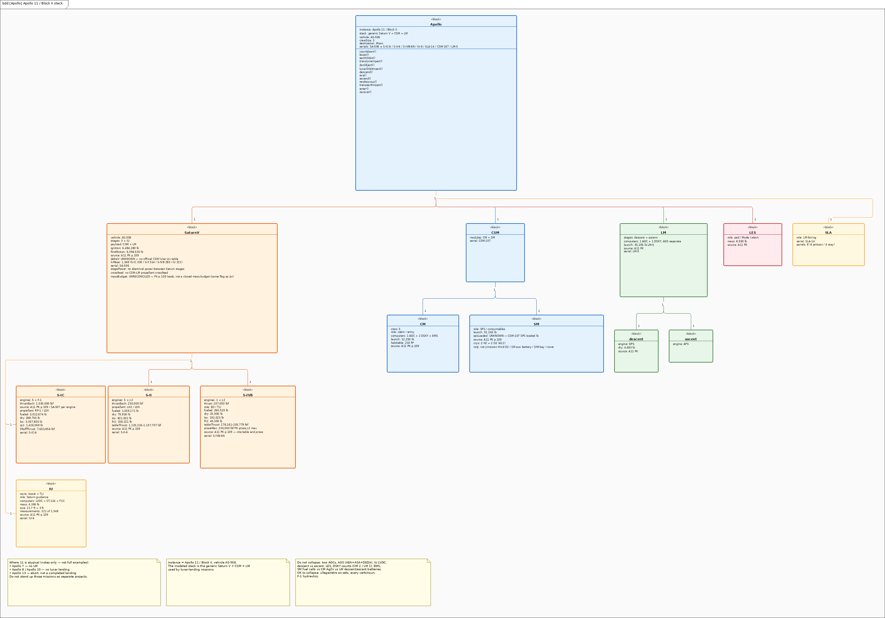

**Figure. `apollo-bdd.png`.** Logical stack at system grain. Saturn V + CSM + LM + LES + SLA.

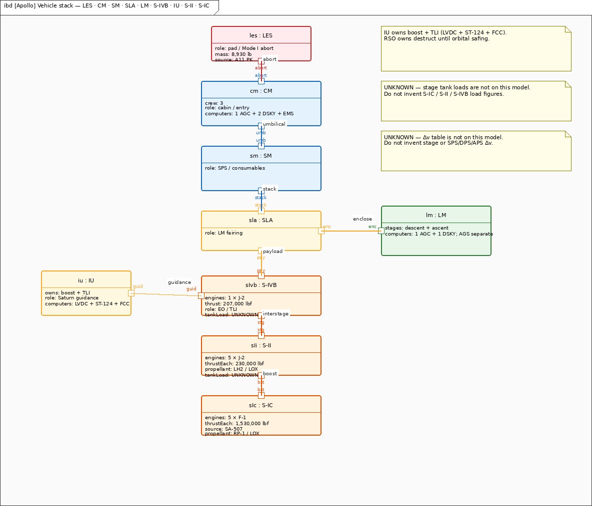

**Figure. `apollo-ibd.png`.** The stack as flown on the pad. Adjacent joints only; connections never pass over boxes.

Two AGCs stay separate from AGS. AGS ≠ DSKY. IU = LVDC + ST-124 + FCC; no digital AGC↔LVDC.

**SPS is on the SM, not the CM.** Service Propulsion System composition is `Apollo.SM` → `Apollo.SPS`. The CSM IBD nests `sps` inside `sm`. Do not hang SPS on the command module. That one fact keeps a reader from drawing the big engine on the wrong can.

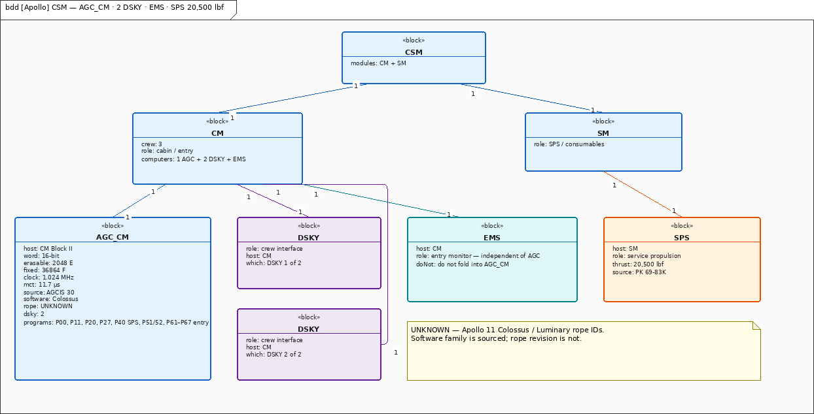

**Figure. `apollo-csm-bdd.png`.** CM and SM. Comanche 055 / Colossus. EMS. SPS cites both 20,500 lbf and 21,500 lbf vac.

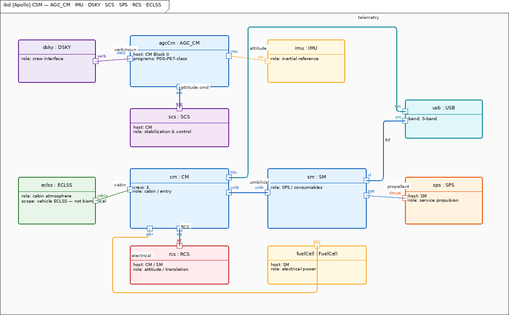

**Figure. `apollo-csm.png`.** CM GNC. SM owns SPS. RCS and ECLSS. **SPS is on the SM.**

The LM is two spacecraft that share a night on the Moon. The descent stage lands and stays. The ascent stage leaves. **Landing Radar (LR) is on the LM descent stage only** (three-beam, P63–P64). Composition is `Apollo.Descent` → `Apollo.LandingRadar`. **Rendezvous Radar (RR) is on the ascent stage only.** Composition is `Apollo.Ascent` → `Apollo.RendezvousRadar`. Primary Guidance and Navigation System (PNGS) is the cockpit switch label for Primary Guidance, Navigation and Control System (PGNCS). PNGS stays on the LM; AGC_LM stays under PNGS. Do not nest rendezvous radar in PNGS. Do not park landing radar under PNGS on the ascent tree.

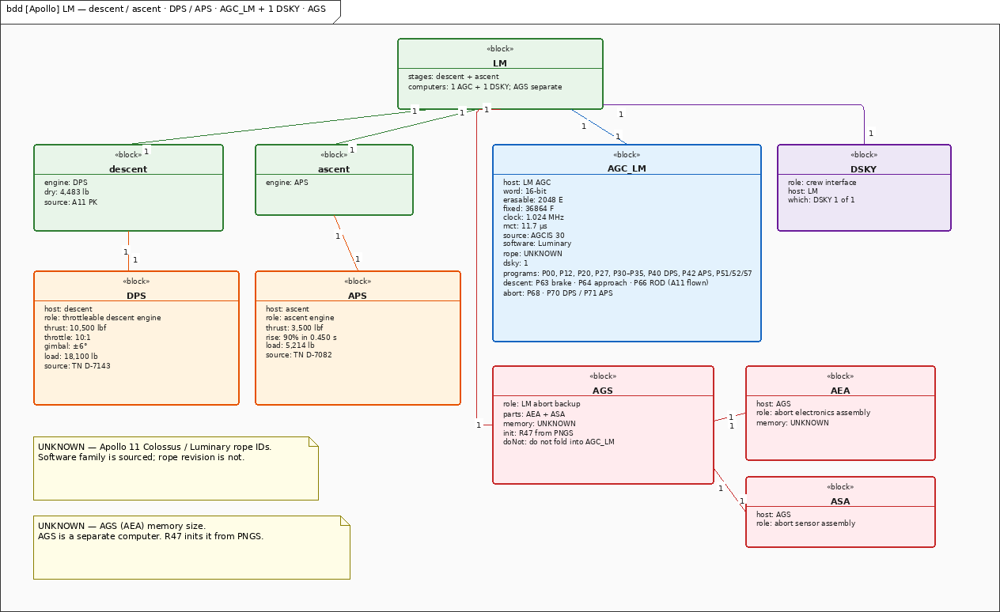

**Figure. `apollo-lm-bdd.png`.** Descent + LR; ascent + RR; Descent Propulsion System (DPS) / Ascent Propulsion System (APS); AGC_LM + one DSKY; AGS. APS here is the LM Ascent Propulsion System, not S-IVB ullage (also historically called APS).

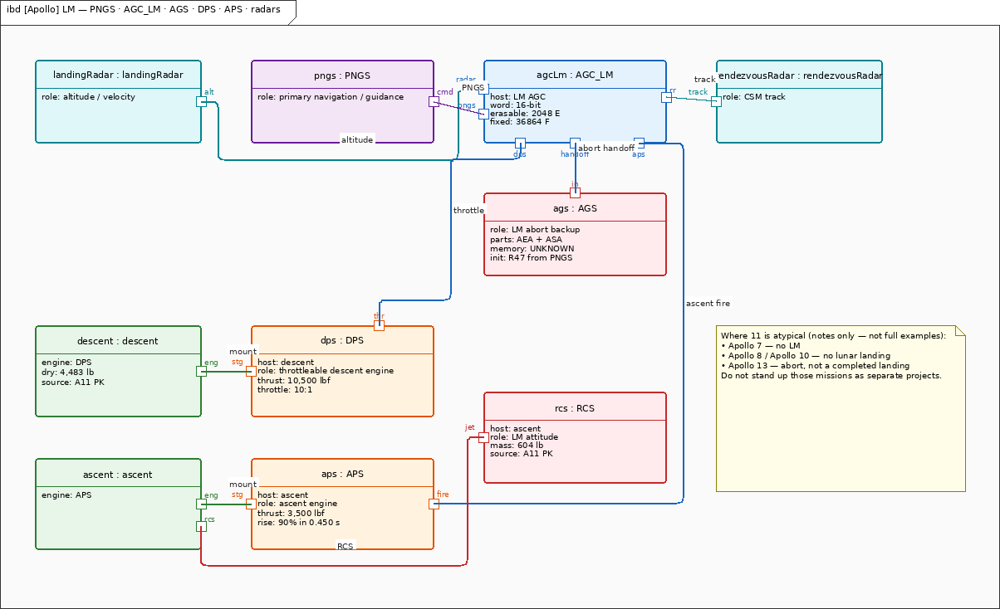

**Figure. `apollo-lm.png`.** PNGS, AGC_LM, AGS, descent + landing radar (three-beam), ascent + rendezvous radar, DPS, APS. RR is not nested in PNGS.

Saturn itself is three burns and a brain. The first stage is five F-1 engines. The second and third stages burn J-2 engines. The IU flies the boost and TLI. There is no stage-to-stage LV electrical power.

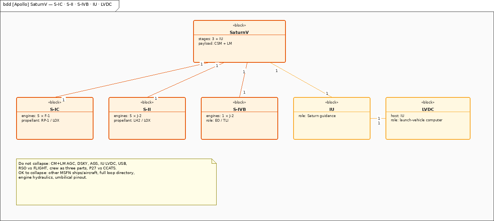

**Figure. `apollo-sat-bdd.png`.** A11 PK p.109 tank loads. S-IC / S-II / S-IVB / IU + engines. F-1 1,530,000 lbf is the SA-507 citation, not an AS-506 requirement.


**Figure. `apollo-sat-ibd.png`.** Stack joints + IU LVDC. No stage-to-stage LV electrical power.

Guidance computers stay separate, and the package diagram is the warning label:

- IU LVDC owns boost + TLI (82.03125 µs, 26+2 bits). No digital path from AGC to LVDC.
- AGC_CM (Block II, 2048 E / 36864 F, 11.7 µs, Comanche 055 + 2 DSKY) owns LOI / TEI / entry (P61–P67).
- AGC_LM (Luminary 1A + 1 DSKY) owns landing / ascent / LM abort (P63–P68 land; P70 DPS / P71 APS).
- AGS (AEA 4096×18, 5 µs, 32.7 lb, TN-7990) is abort-to-orbit / rendezvous only. DEDA is not a DSKY.

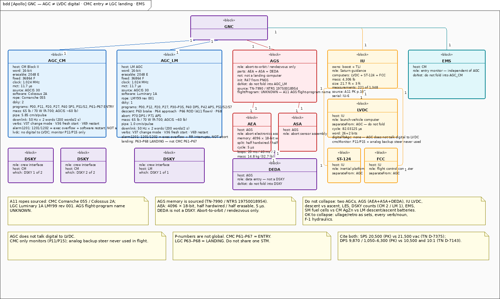

**Figure. `apollo-gnc-pkg.png`.** AGC ≠ LVDC digital. CMC entry ≠ LGC landing. EMS separate.

AGS is its own small computer, not a spare DSKY.


**Figure. `apollo-ags-bdd.png`.** AEA + ASA (strapdown) + DEDA (not a DSKY). Sourced AEA memory (4096×18, 5 µs, 32.7 lb).

Electrical power is three different chemistries. SM three fuel cells on A11 2 H2 + 2 O2 cryo; CM three AgZn + Lower Equipment Bay (LEB) charger + separate pyro; LM four descent + two ascent AgZn with an Electronic Control Assembly (ECA) on each battery.

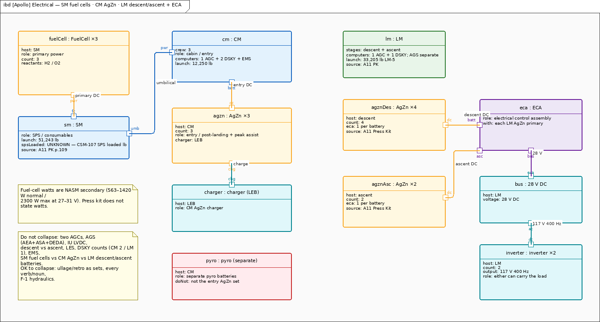

**Figure. `apollo-eps.png`.** SM 3× fuel cells; CM 3× AgZn + LEB charger + pyro; LM 4+2 AgZn + ECA; 28 V / 117 V 400 Hz.

Command paths stay distinct. Path A is Flight Controller (FC) → Command Control Console (CCC) → RTCC → CCATS → site 642B → USB 70 kHz. Path B is P27 V70–V73 into CMC/LGC.

VHF backup is 296.8 / 259.7 MHz (CSM–LM–EVA). Recovery beacon is 243.0 MHz, 3 W, 2 s on / 3 s off.


**Figure. `apollo-usb.png`.** Sourced RF. Crew-selected antennas. P27 ≠ CCATS. Path A vs Path B.

Docking hardware: CM probe, LM drogue, twelve ring latches. Soft dock then hard dock; hardware removed for transfer.

The ground is not “Houston.” It is a set of rooms, ships, and aircraft. MCC-H / GSFC / MSFN / LC-39 / Recovery, consoles, Apollo Instrumentation Ships (AIS), Apollo Range Instrumentation Aircraft (ARIA). RSO/AFETR stay outside MCC.

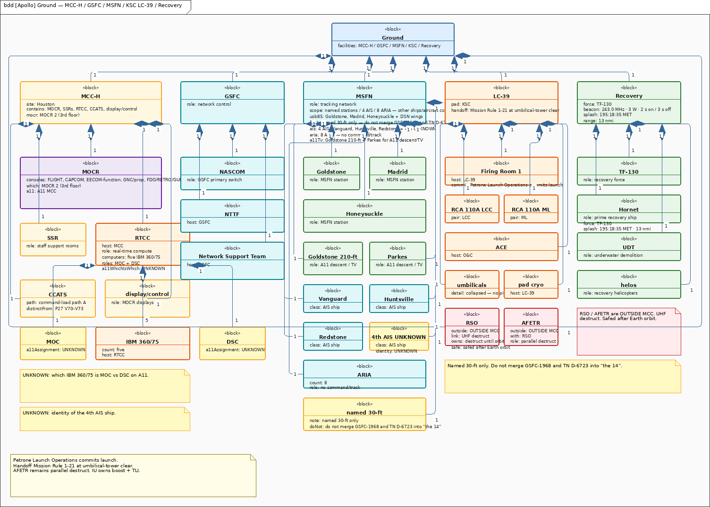

**Figure. `apollo-gnd-bdd.png`.** MCC-H / GSFC / MSFN / LC-39 / Recovery, consoles, AIS, ARIA.

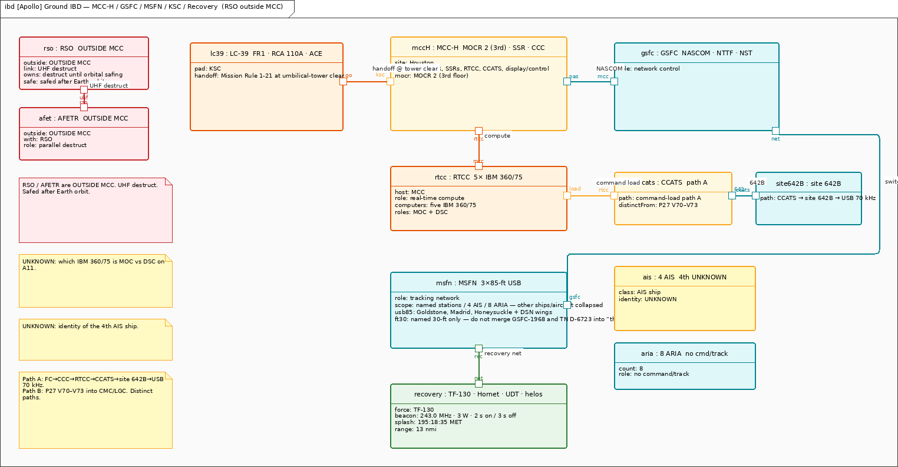

**Figure. `apollo-gnd.png`.** Facility wiring. RSO/AFETR outside MCC. UNKNOWN markers stay visible.

The crew are three people in A7L suits, not one “astronaut” actor. Portable Life Support System (PLSS) and Oxygen Purge System (OPS) ride on CDR and LMP for EVA only. OPS is the EVA Oxygen Purge System, not operations.

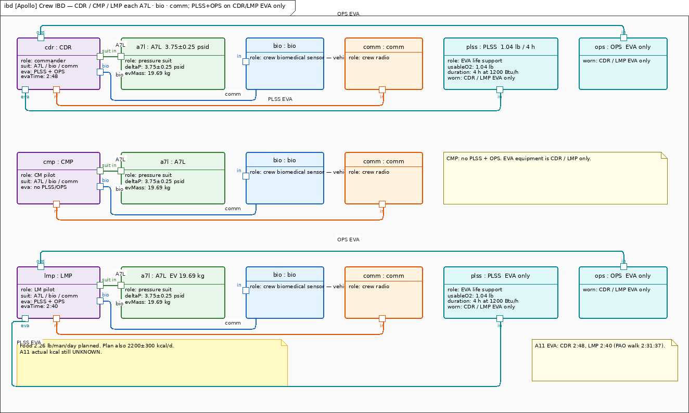

**Figure. `apollo-crew.png`.** CDR / CMP / LMP each in an A7L suit. PLSS + OPS on CDR/LMP EVA only.

RCS is the small-thruster family. SM / LM 100 lbf (A11 PK p.93 / p.106). CM dual 6-engine 93 lbf. Loaded SM RCS mass and loaded CM RCS mass stay UNKNOWN.


**Figure. `apollo-rcs.png`.** SM / LM 100 lbf. CM dual 6-engine 93 lbf. Loaded mass UNKNOWN.

## 4. Behavior

Hardware sits. A mission moves. The design solution operates in time — mission, abort, and computer modes.

The mission state machine (STM) is the plot. Confirm `dockEject` sits between TLI and translunar. Do not draw TLI → translunar. Do not draw `dockEject` → LOI. Do not put translunar before `dockEject`. The locked path is TLI → dockEject → translunar → LOI.


**Figure. `apollo-stm.png`.** countdown → boost → earthOrbit → TLI → dockEject → translunar → LOI → undock → DOI → descent → surface/EVA → ascent → rendezvous → TEI → entry → recovery.

`dockEject` is its own state (CMP-owned, SM RCS, probe-drogue). The activity diagram tells the same phases as a start-to-recovery flow. The docking sequence is the close-up of that one state: probe, drogue, soft capture, twelve latches, stow, transfer.


**Figure. `apollo-act.png`.** Same phase list as a control flow. Functional, not a clock.


**Figure. `apollo-dock.png`.** Soft dock then hard dock. Hardware comes out so the crew can move.

GET: distinguish **planned** vs **flown**. Earth orbit **100 nmi is planned**. TLI has **three labeled numbers** (do not collapse): Press Kit **planned** `02:44:15`; A11-FP **planned** `2:44:26`; **flown** `02:44:16` (MSC-00171). Transposition, Docking, and Ejection (TDE) `~03:20–04:09` GET is **planned**, not flown. LOI-1 has **two strings only**: `75:54:28` GET is **A11-FP planned**; **flown** LOI-1 is `~075:49:50` GET (PAD/MR). Do **not** call TLI `02:44:15`, TDE, or LOI-1 `75:54:28` flown. Splash `195:18:35` Mission Elapsed Time (MET) / 13 nmi sits on Recovery as a sourced MET; that block is not labeled flown. P66 Rate of Descent (ROD) as the A11 landing program is a separate flown-program mark, not a GET clock.

Abort is a second machine that runs beside the first. Pad/LES, Modes I–IV, contingency TLI, SPS abort, lunar abort (P70 DPS / P71 APS). Crew Safety ≠ LES-only. If the tower rocket were the only way out, the later days of the mission would have no door.

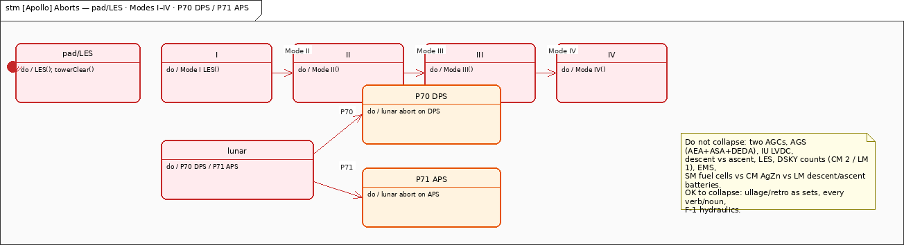

**Figure. `apollo-abort.png`.** pad/LES, Modes I–IV, contingency TLI, SPS abort, P70 DPS / P71 APS. Crew Safety is not LES-only.

CMC P61–P67 is entry only. LGC P63–P68 is landing only (A11 flew P66 ROD). Do not share one P-number STM. Handoff is Mission Rule 1-21 at umbilical-tower clear. RSO ≠ MCC; RSO owns destruct until orbital safing.

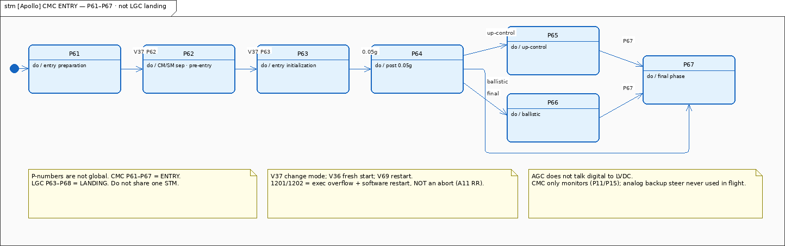

**Figure. `apollo-cmc-stm.png`.** P61–P67 ENTRY only.


**Figure. `apollo-lgc-stm.png`.** P63–P68 LANDING. A11 flew P66 ROD.

The landing sequence is the human chain: MCC → MSFN → USB → AGC_LM / CDR / radar / DPS. Houston speaks. The network carries the words. The LM computer and the Commander fly the last miles.


**Figure. `apollo-seq.png`.** MCC → MSFN → USB → AGC_LM / CDR / radar / DPS.

Uplink has two doors. Path A is the flight-controller load. Path B is the crew’s P27 verbs.


**Figure. `apollo-cmd.png`.** Path A FC→CCC→RTCC→CCATS→642B→USB 70 kHz; Path B P27 V70–V73.

Air and water are a loop, not a medical chart. The ECLSS activity is the cabin atmosphere the vehicle must keep.

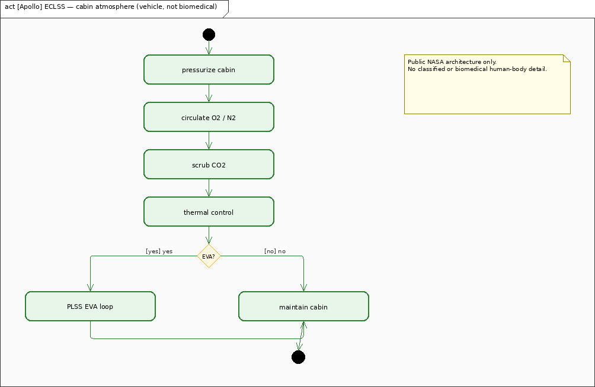

**Figure. `apollo-eclss.png`.** Cabin atmosphere loop (vehicle, not biomedical).

## 5. Parametrics

Numbers in this paper come from NASA pages a reader can still open. Conflicts stay **UNRECONCILED** — cite both, no silent winner. Four fights stay dual-cites: Press Kit p.109 tank and stage loads (not a closed mass budget); two SPS vacuum thrusts; three DPS thrust cites; descent O2 teaching 2,800 psi with a mention of 3,000 psi.

A11 Press Kit p.109 tank loads and launch masses unless noted. **UNRECONCILED** — same flag as Δv. These are sourced stage loads, **not a closed mass budget**.

| Item | Value |
| --- | --- |
| S-IC (AS-506 / S-IC-6) | 7,653,854 lbf liftoff / 5,022,674 lb fueled (A11 PK p.109) |
| F-1 per engine | 1,530,000 lbf — **SA-507 citation** on the F-1 block. Not an AS-506 requirement. |
| S-II | 1,059,171 lb (S-II-6) |
| S-IVB | 260,523 lb (S-IVB-6N) |
| IU | 4,306 lb (IU-6) |
| CM | 12,250 lb |
| SM | 51,243 lb |
| LM-5 | 33,205 lb |
| DPS load | 18,100 lb |
| APS load | 5,214 lb |
| LM RCS | 604 lb; 100 lbf/engine (PK p.106) |
| SM RCS | 100 lbf/engine (PK p.93) |
| CM RCS | 93 lbf/engine, two 6-engine sets |
| LES | 8,930 lb |
| AGC | Block II 2048 E / 36864 F, 11.7 µs, 65 lb / 70 W; AGC_CM Comanche 055 + 2 DSKY; AGC_LM Luminary 1A + 1 DSKY |
| AEA | 4096 × 18-bit, 5 µs, 32.7 lb (TN-7990) |
| APS thrust | 3,500 lbf, 1.5° cant, not gimbaled (TN D-7082) |
| PLSS | 4 h / 1.04 lb O2 (CDR EVA 2:48, LMP 2:40) |

SPS vacuum thrust is **minutiae**, not a required thrust: cite both Press Kit **20,500 lbf** and TN D-7375 **21,500 lbf vac**. DPS has **three** sourced figures and no shall — do not pick a winner: Press Kit **9,870 / 1,050–6,300** lbf; TN D-7143 **10,500** lbf and **10:1**; LMA790 **9,870 / 1,050–6,800** lbf. This note does not invent a required-thrust number. Descent O2 teaching figure is **2,800 psi** (less conservative / schematic). TN D-6724 also prints **3,000 psi**. No required pressure — not an equal dual-cite. USB and VHF stay as already on the model (section 2 and 3).

The ECLSS parametric view binds the sourced CM / LM-5 / A7L (Apollo A7L pressure suit) numbers and the D-7720 food plan. A11 actual kcal and entry blackout stay UNKNOWN.

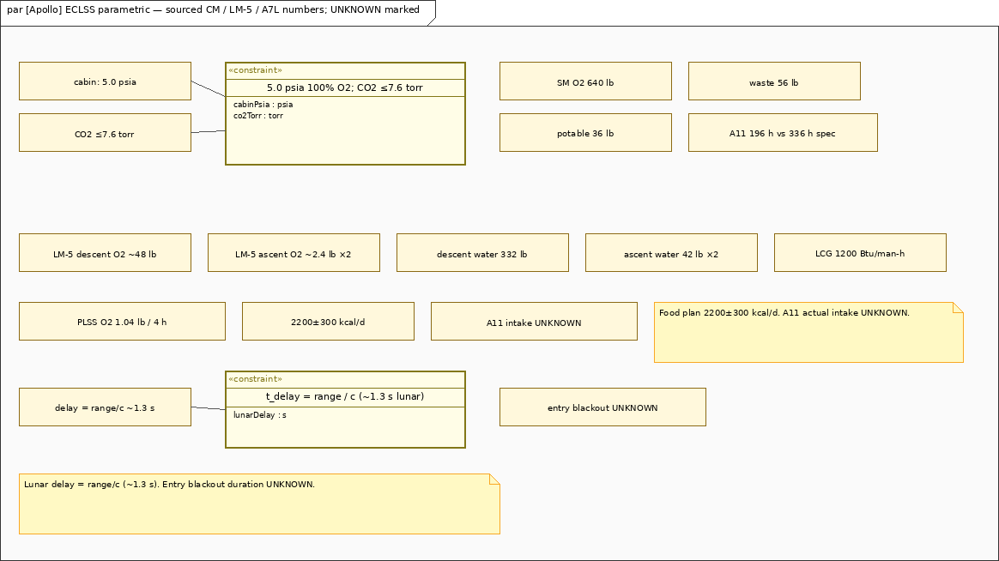

**Figure. `apollo-eclss-par.png`.** Sourced CM / LM-5 / A7L numbers; D-7720 food plan; A11 intake and blackout UNKNOWN.

Fuel-cell wattage is not in the press kit; a secondary National Air and Space Museum (NASM) band is noted on the fuel-cell block and is not promoted to a requirement.

## 6. Allocations

A shall without an owner is a poster. These are the owners on the model.

| Requirement | Allocated to |
| --- | --- |
| Crew Safety | LES (pad / Mode I only), SPS (SPS abort), DPS (P70), APS (P71), AGS (lunar abort backup), ECLSS, CM RCS |
| Landing | Descent (DPS stage) |
| Comms Continuity | USB, MSFN |
| LES Abort | LES |
| Cabin Atmosphere | ECLSS |
| Guidance | AGC_CM, AGC_LM, AGS |
| USB RF | satisfied by USB |
| P27 uplink verbs | satisfied by P27 |

Food plan and LM-5 ECS are on the model as requirements; they do not have `allocate` edges. Treat them as sourced constraints on ECLSS / LM-5, not as invented allocations.

Design bindings that the structure already states (not extra req ids): boost/TLI → IU LVDC; LOI/TEI/entry → AGC_CM; landing/ascent/LM abort → AGC_LM with AGS backup (AGS does not land); EVA portable loop → PLSS on CDR/LMP only; trajectory/uplink compute → RTCC; launch commit → KSC; destruct → RSO; heat shield → CM only.

## 7. Open risks / unmarked

Left unmarked on purpose. Do **not** invent:

- Official CSM lunar Δv table
- CSM-107 SPS loaded mass
- Loaded SM RCS propellant mass
- Loaded CM RCS propellant mass
- A11 AGS flight-program name
- A11 actual kcal
- RTCC Mission Operations Computer (MOC) vs Dynamic Standby Computer (DSC) assignment on A11
- 4th AIS identity
- Entry blackout duration
- Full 30-ft MSFN map

F-1 1,530,000 lbf stays the SA-507 per-engine citation. Do not promote it into an AS-506 requirement. AS-506 S-IC liftoff remains 7,653,854 lbf (PK p.109).

Descent O2 teaching figure is **2,800 psi** (less conservative / schematic). TN D-6724 also prints **3,000 psi**. No required pressure. Tank loads stay **UNRECONCILED**, same flag as Δv. SPS vacuum thrust is minutiae: 20,500 lbf (PK) and 21,500 lbf vac (TN D-7375) — no required thrust. DPS cites all three (PK 9,870 / 1,050–6,300; D-7143 10,500 / 10:1; LMA790 9,870 / 1,050–6,800) — no shall, no winner.

The blanks are part of the lesson. A history paper that fills an official CSM lunar Δv table from memory is no longer a history paper.

## Generated views

Every figure already appears in the story above. This list is only a file map so a student can find a name. It is not a second lecture, and it is not an NPR product catalog.

| File | Already told as |
| --- | --- |
| `apollo-pkg.png` | Filing cabinet for the model |
| `apollo-ctx.png` | Who stands outside the stack |
| `apollo-req.png` | Shalls and sourced constraints |
| `apollo-bdd.png` / `apollo-ibd.png` | Logical stack and pad joints |
| `apollo-sat-bdd.png` / `apollo-sat-ibd.png` | Saturn stages and IU |
| `apollo-csm-bdd.png` / `apollo-csm.png` | CSM; SPS on the SM |
| `apollo-lm-bdd.png` / `apollo-lm.png` | LM; LR descent; RR ascent |
| `apollo-gnc-pkg.png` / `apollo-ags-bdd.png` | Computers that must stay apart |
| `apollo-eps.png` / `apollo-usb.png` / `apollo-rcs.png` | Power, radio, small thrusters |
| `apollo-gnd-bdd.png` / `apollo-gnd.png` / `apollo-crew.png` | Ground and crew |
| `apollo-stm.png` / `apollo-act.png` / `apollo-dock.png` | Mission plot, flow, docking |
| `apollo-abort.png` | Abort doors; not LES-only |
| `apollo-cmc-stm.png` / `apollo-lgc-stm.png` | Entry programs vs landing programs |
| `apollo-seq.png` / `apollo-cmd.png` | Landing chain and uplink doors |
| `apollo-eclss.png` / `apollo-eclss-par.png` | Cabin loop and sourced numbers |
| `apollo-sa506-rollout-69-HC-620.jpg` | NASA 69-HC-620 rollout, 20 May 1969 |

```bash
msml-validate-all projects/apollo --strict
msml-render-all projects/apollo
```
