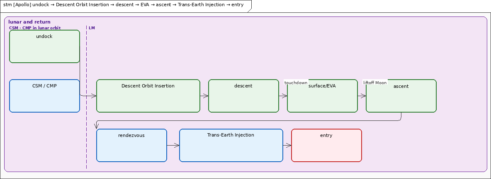

# Apollo 11 / Block II on vehicle AS-506

On 20 May 1969, Saturn V serial SA-506 rolled out of the Vehicle Assembly Building (VAB) at the National Aeronautics and Space Administration (NASA) Kennedy Space Center (KSC) toward Launch Complex 39A (LC-39A). Two months later that same stack lifted three men toward the Moon (NASA, 1969, May 20). Read the flown system the way a design class reads a system: who needed it, what it had to do, which parts did the work, and how the flight ran in time.

The launch vehicle is Saturn V SA-506, built as first stage S-IC-6, second stage S-II-6, third stage S-IVB-6N, and Instrument Unit IU-6. The spacecraft-lunar module adapter is SLA-14. The command and service module is CSM-107. The lunar module is LM-5. Apollo 7, 8, 10, and 13 are notes, not separate projects (7 had no Lunar Module (LM); 8 and 10 did not land; 13 aborted). Namespace `Apollo`. File stem `apollo`. A few values, including an official Command/Service Module (CSM) lunar Δv table, stay unmarked on purpose.

The teaching order is problem first, then solution. That order is called MagicGrid. NASA Procedural Requirements 7123.1 (NPR 7123.1, NASA Systems Engineering Processes and Requirements) is the civil systems-engineering process taught here in **plain language**. Names stay MagicGrid, not NPR product titles. Do not treat MagicGrid section titles as NPR 7123.1 layer names.

## Executive summary

Who needed the mission, why it existed, what sat on the pad, and the thread the clock had to follow.

**Figure.** NASA photograph 69-HC-620, 20 May 1969. Saturn V SA-506 leaving the Vehicle Assembly Building toward LC-39A. Credit: NASA. Public-domain United States government work (NASA, 1969, May 20).

NASA built the stack. The flight crew were Commander (CDR) Neil Armstrong, Command Module Pilot (CMP) Michael Collins, and Lunar Module Pilot (LMP) Edwin Aldrin. Launch commit lived at KSC. After the tower cleared, flight control lived at the Mission Control Center (MCC) in Houston. MCC is Mission Control Center Houston, not a midcourse correction burn. Recovery waited in the Pacific with Task Force 130 (TF-130) and USS *Hornet*. Earth and the Moon were the places the mission had to leave and reach.

The job is one sentence: land a crew on the Moon and bring them home alive. Stages, radios, food, and abort engines exist to serve that sentence.

From the ground up the pad stack is Saturn V first stage (S-IC), second stage (S-II), third stage (S-IVB), and Instrument Unit (IU); the Launch Escape System (LES) over the Command Module (CM); the Service Module (SM) under the CM; the Spacecraft-LM Adapter (SLA) around the LM. The CSM is the CM plus the SM. The LM on this flight was LM-5, a descent stage plus an ascent stage.

The clock runs countdown, boost, Earth orbit, Translunar Injection (TLI), dock and eject the LM (`dockEject`), translunar coast, Lunar Orbit Insertion (LOI), then undock, Descent Orbit Insertion (DOI), descent, surface Extravehicular Activity (EVA), ascent, rendezvous, Trans-Earth Injection (TEI), entry, and recovery. The locked path is TLI → dockEject → translunar → LOI.

Ground Elapsed Time (GET) is the mission clock. Planned times and flown times are different labels. The Apollo 11 Flight Plan (A11-FP; NASA Manned Spacecraft Center, Flight Planning Branch, 1969), the Press Kit (PK; NASA, 1969), and the flown Preliminary Advisory Data (PAD) as reported with the Mission Report (MR; NASA, 1969, November) do not always print the same GET. Section 4 keeps those labels apart.

Official CSM lunar Δv, CSM-107 SPS loaded mass, and loaded SM / CM Reaction Control System (RCS) mass stay unmarked. Those blanks are not invitations to invent.

## Problem domain

The problem is a crew, a Moon, a way home, and a ground network that must still hear the vehicle a quarter of a million miles out. Name that world before the hardware.

## 1. Problem / context

Launch commit sits at KSC Launch Complex 39 (LC-39). Flight control after tower clear sits at Mission Control Center Houston (MCC-H). Apollo 11 used Mission Operations Control Room 2 (MOCR 2). Trajectory and uplink compute sit at the Real-Time Computer Complex (RTCC). The ground network is Goddard Space Flight Center (GSFC) / NASA Communications Network (NASCOM) and the Manned Space Flight Network (MSFN). The Range Safety Officer (RSO) / Air Force Eastern Test Range (AFETR) owns destruct **outside** MCC. Recovery is TF-130 / USS *Hornet*. Handoff is KSC → MCC at tower clear — Mission Rule 1-21. RSO is not MCC.

Look at the people and places around the vehicle, not the engines. Unified S-Band (USB) is the main radio path. Very High Frequency (VHF) is the backup voice path.

**Figure. `apollo-ctx.png`.** Vehicle in the middle. Earth left, Moon right, crew above. Tracking net and Mission Control sit below, Mission Control on the right so the radio lines miss the Earth–Moon path.

The command module computer, the lunar module guidance computer, the abort guidance system, and the launch-vehicle digital computer stay on their own hosts. They are not folded into one box. The command module computer is Colossus / Comanche 055 with two Display and Keyboard (DSKY) units. The lunar module computer is Luminary 1A / LMY99 rev 001 with one DSKY. Abort Guidance System (AGS) is the Abort Electronics Assembly (AEA), Abort Sensor Assembly (ASA), and Data Entry and Display Assembly (DEDA). DEDA is not a DSKY, and AGS is not a landing computer. The IU is the Launch Vehicle Digital Computer (LVDC) plus ST-124 plus the Flight Control Computer (FCC). There is no digital path from an Apollo Guidance Computer (AGC) to the LVDC. The Entry Monitor System (EMS) is independent of the AGC. Descent stays distinct from ascent. Service-module fuel cells stay distinct from command-module silver-zinc (AgZn) batteries and from lunar-module AgZn batteries. Service-module RCS quads stay distinct from the command module’s dual six-engine sets. USB stays distinct from VHF / High Frequency (HF) backup. RSO and AFETR stay outside MCC. The crew are three people, not one actor.

Lunar-orbit rendezvous is the mission: boost and TLI on Saturn, dock and extract the LM, coast translunar, LOI, land, EVA, ascent, rendezvous, TEI, entry, and recovery. There is no stage-to-stage Launch Vehicle (LV) electrical power on Saturn, and no CSM–LM propellant crossfeed.

The ground family-tree view is more than eight thousand pixels wide after a reflow. Leave it in the folder. RSO and USS *Hornet* are already in the prose above.

## 2. Requirements and use cases

A requirement is a shall. Crew Safety is **Not LES-only**. Food is a 1967 plan printed in a 1974 technical note, not a flown calorie count (Smith et al., 1974).

**Figure. `apollo-req.png`.** Six jobs. Read safety first: abort is a family of doors, not one tower rocket. Food, oxygen pressure, and engine thrust stay in the sentences below. They are not shalls on this figure.

An abort path shall remain available from pad through TEI. That shall is **Not LES-only**. The Lunar Module shall land two crew on the Moon with remaining descent Δv margin at the site. That land box is the lunar landing. Splash is not taught there. Margin is required; an official CSM lunar Δv table is not filled. The tracking net shall carry voice and telemetry except during known lunar occultation. The launch escape system shall pull the Command Module clear of Saturn on a pad or Mode I abort.

The Command Module shall keep a livable cabin atmosphere. That job belongs to the Command Module Environmental Control System (ECS), also called the Environmental Control and Life Support System (ECLSS). The spec is three crew. Those three people are carried for fourteen days. Cabin pressure is 5.0 psia. The gas is 100% oxygen. Carbon dioxide stays at or below 7.6 torr. Service-module oxygen is 640 lb. The crew drinks from 36 lb of potable water. Waste water is 56 lb. Lithium hydroxide canisters last 1.5 man-day. They swap every 12 hours. Apollo 11 itself is 196 hours of flight. The spec it was sized against is 336 hours.

The command-module and lunar-module computers shall provide Guidance, Navigation, and Control (GNC). AGS is the lunar-module abort backup.

The stack shall communicate with the tracking net on unified S-band. The command module listens up at 2106.40625 MHz. It talks down at 2287.5 MHz on phase modulation. A second downlink at 2272.5 MHz uses frequency modulation. The lunar module listens up at 2101.802 MHz. It talks down at 2282.5 MHz. Telemetry can run at 51.2 kbps. It can also drop to 1.6 kbps. Digital uplink is about 2 kbps. Ranging uses a 992 kbps pseudo-random-noise code. That ranging is good to ±15 m. The same code stays unambiguous out to about 540,000 miles. Uplink verbs shall be limited to V70 through V73 into the Command Module Computer (CMC) / LM Guidance Computer (LGC). That door is Path B. Path A is the Command, Communications, and Telemetry System (CCATS) load.

Food is not a flown calorie count. It is the **D-7720 April 1967** plan, printed later in a 1974 technical note (Smith et al., 1974). That plan is **2800 kcal/man/day** in the Command Module. It is **3200 kcal/man/day** in the Lunar Module. Planned mass is 2.26 lb/man/day. That 1967 plan year lives inside the 1974 document. It is not A11 flown intake. A11 actual kcal still UNKNOWN.

Lunar-module descent oxygen is a **2,800 psi** teaching figure (less conservative / schematic). NASA TN D-6724 also prints **3,000 psi** (NASA, 1972). No required pressure. That oxygen pair is not an equal dual-cite. Ascent oxygen is about 2.4 lb. Those 2.4 lb sit in each of two bottles. Descent water is 332 lb. Ascent water is 42 lb. Those 42 lb sit in each of two tanks. The Liquid Cooling Garment (LCG) is sized at 1200 Btu/man-h steady.

The mission itself is the use case: fly the timeline, abort if the timeline breaks, land, walk, come home.

## Solution domain

Requirements, Structure, Behavior, Parametrics, and Allocations. That is the rest of the walk.

## 3. Structure

The system definition keeps six parts so it reads at page size: the Apollo stack, Saturn V, the command and service module, the lunar module, the launch escape system, and the adapter.

**Figure. `apollo-bdd.png`.** Six parts. Stages, computers, and radars wait for the views that name them. Nothing was invented to fill the page.

The pad stack, read from the ground up, is S-IC-6, S-II-6, S-IVB-6N, IU-6, SLA-14 (8 panels: 4 jettison / 4 stay; LM-5), SM (owns the Service Propulsion System (SPS)), CM, LES. **SPS is on the SM, not the CM.** Composition is `Apollo.SM` → `Apollo.SPS`. Do not hang SPS on the command module.

The Saturn V internal view is adjacent joints only. Lines are not allowed to pass over boxes.

**Figure. `apollo-sat-ibd.png`.** First stage, second stage, third stage, and the Instrument Unit, stacked the way they sat on the pad. No stage-to-stage LV electrical power.

F-1 1,530,000 lbf is the **SA-507** per-engine citation, not an AS-506 requirement. AS-506 S-IC liftoff remains 7,653,854 lbf (NASA, 1969, p. 109).

Landing Radar (LR) is on the LM descent stage only (three-beam, P63–P64). Composition is `Apollo.Descent` → `Apollo.LandingRadar`. Rendezvous Radar (RR) is on the ascent stage only. Composition is `Apollo.Ascent` → `Apollo.RendezvousRadar`. Primary Guidance and Navigation System (PNGS) is the cockpit switch label for Primary Guidance, Navigation and Control System (PGNCS). PNGS stays on the LM; AGC_LM stays under PNGS. Do not nest rendezvous radar in PNGS.

The lunar-module page keeps eight parts. Descent and ascent stay nested under the lunar module. Descent propulsion and landing radar stay nested under descent. Ascent propulsion and rendezvous radar stay nested under ascent. Abort guidance is its own computer, not a spare DSKY. The internals view still crosses ports, so it stays out of the lecture until the lines miss the boxes.

**Figure. `apollo-lm-bdd.png`.** Eight parts on the page. The hierarchy stays: lunar module, then the two stages, then the engine and radar that belong to each stage.

AGS is three boxes. Keep DEDA off the DSKY list.

**Figure. `apollo-ags-bdd.png`.** AEA + ASA (strapdown) + DEDA (not a DSKY). AEA memory 4096×18, 5 µs, 32.7 lb (Kurten, 1975).

Guidance computers stay separate. IU LVDC owns boost + TLI (82.03125 µs, 26+2 bits). No digital path from AGC to LVDC. AGC_CM (Block II, 2048 E / 36864 F, 11.7 µs, Comanche 055 + 2 DSKY) owns LOI / TEI / entry (P61–P67). AGC_LM (Luminary 1A + 1 DSKY) owns landing / ascent / LM abort (P63–P68 land; P70 Descent Propulsion System (DPS) / P71 Ascent Propulsion System (APS)). APS here is the LM Ascent Propulsion System, not S-IVB ullage (also historically called APS). Abort Guidance operate/follow-PNGS is concurrent with Primary Guidance. AGS still does not land. AGS is abort-to-orbit / rendezvous only. There is no fourth computer region.

Electrical power, in words: the service module flew three fuel cells on Apollo 11 with two hydrogen and two oxygen cryogenic tanks. The command module has three silver-zinc batteries, a Lower Equipment Bay (LEB) charger, and a separate pyro bus. The lunar module has four descent and two ascent silver-zinc batteries, with an Electronic Control Assembly (ECA) on each battery.

Command paths stay distinct. Path A is Flight Controller (FC) to the Command Control Console (CCC) to RTCC to CCATS to site 642B to USB at 70 kHz. Path B is P27 verbs V70 through V73 into the command-module or lunar-module computer. VHF backup voice is 296.8 MHz and 259.7 MHz among the command module, the lunar module, and the EVA crew. The recovery beacon is 243.0 MHz, 3 W, two seconds on and three seconds off.

Radios and antennas, not engines:

**Figure. `apollo-usb.png`.** Sourced RF and crew-selected antennas. P27 is not CCATS. Path A and Path B stay apart.

Docking hardware: CM probe, LM drogue, twelve ring latches. Soft dock then hard dock; hardware removed for transfer.

RCS is the small-thruster family. SM / LM 100 lbf (NASA, 1969, pp. 93, 106). CM dual 6-engine 93 lbf. Loaded SM RCS mass and loaded CM RCS mass stay UNKNOWN.

**Figure. `apollo-rcs.png`.** SM and LM at 100 lbf; CM dual 6-engine 93 lbf. Loaded mass is not filled.

The Portable Life Support System (PLSS) and Oxygen Purge System (OPS) ride on CDR and LMP for EVA only. OPS is the EVA Oxygen Purge System, not operations.

## 4. Behavior

The mission clock cannot skip a beat. Confirm `dockEject` sits between TLI and translunar. Do not draw TLI → translunar. Do not draw `dockEject` → LOI. The locked path is TLI → dockEject → translunar → LOI. The clock is split across two figures so each page stays at or under ten visible states. Fewer boxes on the page is not a flat machine. Outbound is one composite. Lunar and return is another. Descent, surface/EVA, and ascent nest under a surface composite inside lunar and return. Recovery stays in that same lunar-and-return composite even though splash is taught only in the GET sentences. Abort is an orthogonal region of that same mission machine, not a second flattened clock. After undock, the CSM with the Command Module Pilot stays in lunar orbit concurrent with the LM from DOI through ascent. Range Safety destruct is concurrent with Mission Control until it is safed after Earth orbit.

**Figure. `apollo-stm.png`.** The outbound composite holds countdown → boost → earthOrbit → TLI → dockEject → translunar → LOI. The dashed region is abort plus Range Safety destruct, concurrent with the nominal clock until destruct is safed after Earth orbit. The locked path is the four states in the middle of the top row.

**Figure. `apollo-stm-lunar.png`.** After undock the page splits: CSM / CMP in lunar orbit runs concurrent with the LM from DOI through ascent. Descent, surface/EVA, and ascent still nest under the surface composite in the model. Splash and recovery live in the GET paragraph below, not on the Land box.

`dockEject` is its own state (CMP-owned, SM RCS, probe-drogue).

Docking is one close-up: probe, drogue, soft capture, twelve latches, stow, transfer.

**Figure. `apollo-dock.png`.** Soft dock then hard dock. Hardware comes out so the crew can move.

GET: distinguish **planned** vs **flown**. Earth orbit **100 nmi is planned**. TLI has **three labeled numbers** (do not collapse): Press Kit **planned** `02:44:15` (NASA, 1969); A11-FP **planned** `2:44:26` (NASA Manned Spacecraft Center, Flight Planning Branch, 1969); **flown** `02:44:16` (MSC-00171; NASA, 1969, November). Transposition, Docking, and Ejection (TDE) `~03:20–04:09` GET is **planned**, not flown. LOI-1 has **two strings only**: `75:54:28` GET is **A11-FP planned**; **flown** LOI-1 is `~075:49:50` GET (PAD/MR). Do **not** call TLI `02:44:15`, TDE, or LOI-1 `75:54:28` flown. Splash `195:18:35` is the **flown GET**. 13 nmi is from USS *Hornet*, not from the target. The weather-revised miss was ~1.7 nmi. P66 Rate of Descent (ROD) as the A11 landing program is a separate flown-program mark, not a GET clock.

Abort is a family of doors, orthogonal to the nominal clock. This figure is that abort region, not a second flattened mission chart. Modes I through IV run right along the top row. Lunar abort forks right into P70 (descent propulsion) and P71 (ascent propulsion).

**Figure. `apollo-abort.png`.** The abort orthogonal region. Pad and Modes I–IV on the top row, pointing right. Lunar abort points right into P70 and P71 the same way. Crew Safety is not LES-only.

CMC P61–P67 is entry only. LGC P63–P68 is landing only (A11 flew P66 ROD). Do not share one P-number picture. The CMC entry view still clips labels, so it stays out. The LGC landing programs are the readable one.

**Figure. `apollo-lgc-stm.png`.** P63–P68 LANDING. A11 flew P66 ROD. Abort Guidance sits concurrent in operate/follow-PNGS and does not land.

Handoff is Mission Rule 1-21 at umbilical-tower clear. RSO ≠ MCC; RSO owns destruct until orbital safing.

Landing, as a human chain: Mission Control → tracking net → USB → lunar-module computer / Commander / radar / descent propulsion.

**Figure. `apollo-seq.png`.** Houston speaks. The network carries the words. The LM computer and the Commander fly the last miles.

Uplink has two doors. Path A is the flight-controller load through CCATS and USB. Path B is P27 verbs V70 through V73. Cabin-loop numbers stay in sections 2 and 5.

## 5. Parametrics

Every number below comes from NASA pages a reader can still open. Conflicts stay **UNRECONCILED** — no silent winner. Press Kit page 109 tank and stage loads are not a closed mass budget (NASA, 1969). SPS vacuum thrust is two cites. DPS has three cites and no shall. Descent O2 is a teaching figure of **2,800 psi**; TN D-6724 also prints **3,000 psi** (NASA, 1972). That oxygen pair is not an equal dual-cite.

Press Kit page 109 lists the SA-506 tank loads. Those figures stay **UNRECONCILED**. They are not a closed mass budget.

Start on the ground. The S-IC on AS-506 (S-IC-6) lifted off at 7,653,854 lbf. Its fueled mass is listed at 5,022,674 lb. F-1 per engine 1,530,000 lbf is the **SA-507** citation, not an AS-506 requirement.

The second stage is next. S-II-6 is listed at 1,059,171 lb.

The third stage follows. S-IVB-6N is listed at 260,523 lb. IU-6 is listed at 4,306 lb.

Then the spacecraft. The command module is listed at 12,250 lb. The service module is listed at 51,243 lb. LM-5 is listed at 33,205 lb. Its descent-propulsion load is 18,100 lb. Its ascent-propulsion load is 5,214 lb.

Small thrusters have their own lines. Lunar-module RCS is listed at 604 lb. Those engines are 100 lbf each (NASA, 1969, p. 106). Service-module RCS is 100 lbf per engine (NASA, 1969, p. 93). Command-module RCS is 93 lbf per engine. Those command-module engines sit in two six-engine sets. The launch escape system is listed at 8,930 lb.

Computers are a different kind of number. The Block II AGC is 2048 words of erasable memory. It is 36864 words of fixed memory. Cycle time is 11.7 µs. The box is 65 lb. It draws 70 W. The abort electronics assembly is 4096 × 18-bit. Its cycle is 5 µs. The box is 32.7 lb (Kurten, 1975).

Ascent-propulsion thrust is 3,500 lbf. It is canted 1.5°. It is not gimbaled (NASA, 1973, March).

The portable life-support loop is sized for four hours. It carries 1.04 lb of oxygen. CDR EVA 2:48 / LMP 2:40 is **TN D-8093 Table I** (Lutz et al., 1975). That is not the PAO hatch-to-hatch 2:31:40.

SPS vacuum thrust is **minutiae**, not a required thrust: cite both Press Kit **20,500 lbf** (NASA, 1969) and TN D-7375 **21,500 lbf vac** (NASA, 1973, August). DPS has **three** sourced figures and no shall — do not pick a winner: Press Kit **9,870 / 1,050–6,300** lbf (NASA, 1969); TN D-7143 **10,500** lbf and **10:1** (NASA, 1973, March); LMA790 **9,870 / 1,050–6,800** lbf. LMA790 stays unmarked in the References list; title and date are not in hand. A required-thrust number is not invented. Descent O2 teaching figure is **2,800 psi** (less conservative / schematic). TN D-6724 also prints **3,000 psi** (NASA, 1972). No required pressure. That oxygen pair is not an equal dual-cite.

Fuel-cell wattage is not in the press kit. A secondary National Air and Space Museum (NASM) band is noted on the fuel-cell block and is not promoted to a requirement. Apollo Guidance Computer Information Series (AGCIS) 30 stays unmarked as a cite; title and date are not in hand.

## 6. Allocations

A shall without an owner is a poster. Crew Safety is allocated to LES (pad / Mode I only), SPS (SPS abort), DPS (P70), APS (P71), AGS (lunar abort backup), ECLSS, and CM RCS. Landing is allocated to Descent (DPS stage). Comms Continuity is allocated to USB and MSFN. LES Abort is allocated to LES. Cabin Atmosphere is allocated to ECLSS. Guidance is allocated to AGC_CM, AGC_LM, and AGS. USB RF is satisfied by USB. P27 uplink verbs are satisfied by P27.

Food plan and LM-5 ECS are on the model as requirements; they do not have `allocate` edges. Treat them as sourced constraints on ECLSS / LM-5, not as invented allocations.

Design bindings that the structure already states: boost/TLI → IU LVDC; LOI/TEI/entry → AGC_CM; landing/ascent/LM abort → AGC_LM with AGS backup (AGS does not land); EVA portable loop → PLSS on CDR/LMP only; trajectory/uplink compute → RTCC; launch commit → KSC; destruct → RSO; heat shield → CM only.

## 7. Open risks / unmarked

Left unmarked on purpose. Do **not** invent:

- Official CSM lunar Δv table
- CSM-107 SPS loaded mass
- Loaded SM RCS propellant mass
- Loaded CM RCS propellant mass
- A11 AGS flight-program name
- A11 actual kcal
- RTCC Mission Operations Computer (MOC) vs Dynamic Standby Computer (DSC) assignment on A11
- 4th Apollo Instrumentation Ship (AIS) identity
- Entry blackout duration
- Full 30-ft MSFN map

F-1 1,530,000 lbf stays the SA-507 per-engine citation. Do not promote it into an AS-506 requirement. AS-506 S-IC liftoff remains 7,653,854 lbf (NASA, 1969, p. 109).

Descent O2 teaching figure is **2,800 psi** (less conservative / schematic). TN D-6724 also prints **3,000 psi** (NASA, 1972). No required pressure. That oxygen pair is not an equal dual-cite. Tank loads stay **UNRECONCILED**, same flag as Δv. SPS vacuum thrust is minutiae: 20,500 lbf (PK) and 21,500 lbf vac (TN D-7375) — no required thrust. DPS cites all three (PK 9,870 / 1,050–6,300; D-7143 10,500 / 10:1; LMA790 9,870 / 1,050–6,800) — no shall, no winner. LMA790 is unmarked in References.

## Generated views

The figures in the sections above are the ones to read in class. The rest of the folder is still there if someone wants the internals. Omitted views were not deleted.

Used in the lecture: `apollo-sa506-rollout-69-HC-620.jpg`, `apollo-ctx.png`, `apollo-req.png`, `apollo-bdd.png`, `apollo-sat-ibd.png`, `apollo-lm-bdd.png`, `apollo-ags-bdd.png`, `apollo-usb.png`, `apollo-rcs.png`, `apollo-stm.png`, `apollo-stm-lunar.png`, `apollo-dock.png`, `apollo-abort.png`, `apollo-lgc-stm.png`, `apollo-seq.png`.

Left in the folder: `apollo-act.png` (sixteen actions), `apollo-cmd.png`, `apollo-gnd-bdd.png`, `apollo-sat-bdd.png`, `apollo-ibd.png`, `apollo-csm-bdd.png`, `apollo-csm.png`, `apollo-lm.png`, `apollo-gnd.png`, `apollo-crew.png`, `apollo-eps.png`, `apollo-gnc-pkg.png`, `apollo-eclss.png`, `apollo-eclss-par.png`, `apollo-cmc-stm.png`. No new parts were invented to fill those pictures.

## References

Kurten, P. M. (1975, July). *Abort Guidance System* (NASA TN D-7990). National Aeronautics and Space Administration.

Lutz, C. C., et al. (1975, November). *Development of the Extravehicular Mobility Unit* (NASA TN D-8093). National Aeronautics and Space Administration.

National Aeronautics and Space Administration. (1969). *Apollo 11 press kit* (Release No. 69-83K).

National Aeronautics and Space Administration. (1969, May 20). Photograph 69-HC-620 [Photograph]. Public domain.

National Aeronautics and Space Administration. (1969, November). *Apollo 11 mission report* (MSC-00171).

National Aeronautics and Space Administration. (1972). *Apollo Experience Report: Lunar Module Environmental Control Subsystem* (NASA TN D-6724).

National Aeronautics and Space Administration. (1973, March). *Apollo Experience Report: Ascent Propulsion System* (NASA TN D-7082).

National Aeronautics and Space Administration. (1973, March). *Apollo Experience Report: Descent Propulsion System* (NASA TN D-7143).

National Aeronautics and Space Administration. (1973, August). *Apollo Experience Report: Service Propulsion Subsystem* (NASA TN D-7375).

NASA Manned Spacecraft Center, Flight Planning Branch. (1969, July 1). *Apollo 11 flight plan* (Final).

Smith, M. C., et al. (1974, July). *Food systems* (NASA TN D-7720). National Aeronautics and Space Administration.
