# Apollo 11 / Block II on vehicle AS-506

On 20 May 1969, Saturn V serial SA-506 rolled out of the Vehicle Assembly Building (VAB) at the National Aeronautics and Space Administration (NASA) Kennedy Space Center (KSC) toward Launch Complex 39A (LC-39A). Two months later that same stack lifted three men toward the Moon (NASA, 1969, May 20). The question this paper answers is not how to draw a rocket. It is how the flown system was put together: who needed it, what it had to do, which parts did the work, and how the flight ran in time.

The instance is Apollo 11 / Block II on vehicle AS-506: SA-506 = S-IC-6 / S-II-6 / S-IVB-6N / IU-6 / SLA-14 / CSM-107 / LM-5. Apollo 7, 8, 10, and 13 are notes, not separate projects (7 had no Lunar Module (LM); 8 and 10 did not land; 13 aborted). Namespace `Apollo`. File stem `apollo`. Civil / historical architecture only. A few values, including an official Command/Service Module (CSM) lunar Δv table, stay unmarked on purpose.

The teaching order is problem first, then solution. That order is called MagicGrid. NASA Procedural Requirements 7123.1 (NPR 7123.1, NASA Systems Engineering Processes and Requirements) is the civil systems-engineering process taught here in **plain language**. Names stay MagicGrid, not NPR product titles. Do not treat MagicGrid section titles as NPR 7123.1 layer names. This is not a Department of Defense Architecture Framework (DoDAF) product set.

## Executive summary

Who needed the mission, why it existed, what sat on the pad, and the thread the clock had to follow. That is the classroom overview. It is not a DoDAF product.

A photograph records a physical object. The rollout picture below is NASA photograph 69-HC-620, public domain.

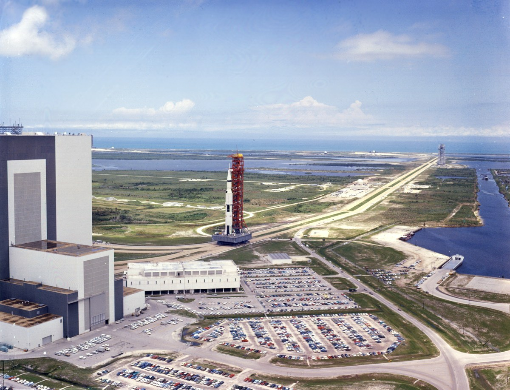

**Figure.** NASA photograph 69-HC-620, 20 May 1969. Saturn V SA-506 leaving the Vehicle Assembly Building toward LC-39A. Credit: NASA. Public-domain United States government work (NASA, 1969, May 20).

**Who.** NASA built the stack. The flight crew were Commander (CDR) Neil Armstrong, Command Module Pilot (CMP) Michael Collins, and Lunar Module Pilot (LMP) Edwin Aldrin. Launch commit lived at KSC. After the tower cleared, flight control lived at the Mission Control Center (MCC) in Houston. MCC is Mission Control Center Houston, not a midcourse correction burn. Recovery waited in the Pacific with Task Force 130 (TF-130) and USS *Hornet*. Earth and the Moon were the places the mission had to leave and reach.

**Why.** Land a crew on the Moon and bring them home alive. Stages, radios, food, and abort engines exist to serve that sentence.

**The stack.** From the ground up: Saturn V first stage (S-IC), second stage (S-II), third stage (S-IVB), and Instrument Unit (IU); the Launch Escape System (LES) over the Command Module (CM); the Service Module (SM) under the CM; the Spacecraft-LM Adapter (SLA) around the LM. The CSM is the CM plus the SM. The LM on this flight was LM-5, a descent stage plus an ascent stage.

**The mission thread.** Countdown, boost, Earth orbit, Translunar Injection (TLI), dock and eject the LM (`dockEject`), translunar coast, Lunar Orbit Insertion (LOI), then undock, Descent Orbit Insertion (DOI), descent, surface Extravehicular Activity (EVA), ascent, rendezvous, Trans-Earth Injection (TEI), entry, and recovery. The locked path is TLI → dockEject → translunar → LOI.

Ground Elapsed Time (GET) is the mission clock. Planned times and flown times are different labels. The Apollo 11 Flight Plan (A11-FP; NASA Manned Spacecraft Center, Flight Planning Branch, 1969), the Press Kit (PK; NASA, 1969), and the flown Preliminary Advisory Data (PAD) as reported with the Mission Report (MR; NASA, 1969, November) do not always print the same GET. Section 4 keeps those labels apart.

Official CSM lunar Δv, CSM-107 SPS loaded mass, and loaded SM / CM Reaction Control System (RCS) mass stay unmarked. Those blanks are not invitations to invent.

## Problem domain

The problem is a crew, a Moon, a way home, and a ground network that must still hear the vehicle a quarter of a million miles out. Hardware waits until that world is named.

## 1. Problem / context

Launch commit sits at KSC Launch Complex 39 (LC-39). Flight control after tower clear sits at Mission Control Center Houston (MCC-H). Apollo 11 used Mission Operations Control Room 2 (MOCR 2). Trajectory and uplink compute sit at the Real-Time Computer Complex (RTCC). The ground network is Goddard Space Flight Center (GSFC) / NASA Communications Network (NASCOM) and the Manned Space Flight Network (MSFN). The Range Safety Officer (RSO) / Air Force Eastern Test Range (AFETR) owns destruct **outside** MCC. Recovery is TF-130 / USS *Hornet*. Handoff is KSC → MCC at tower clear — Mission Rule 1-21. RSO is not MCC.

A context internal block diagram (IBD) shows who stands around the vehicle. It is not a wiring diagram of the engines. Unified S-Band (USB) is the main radio path. Very High Frequency (VHF) is the backup voice path.

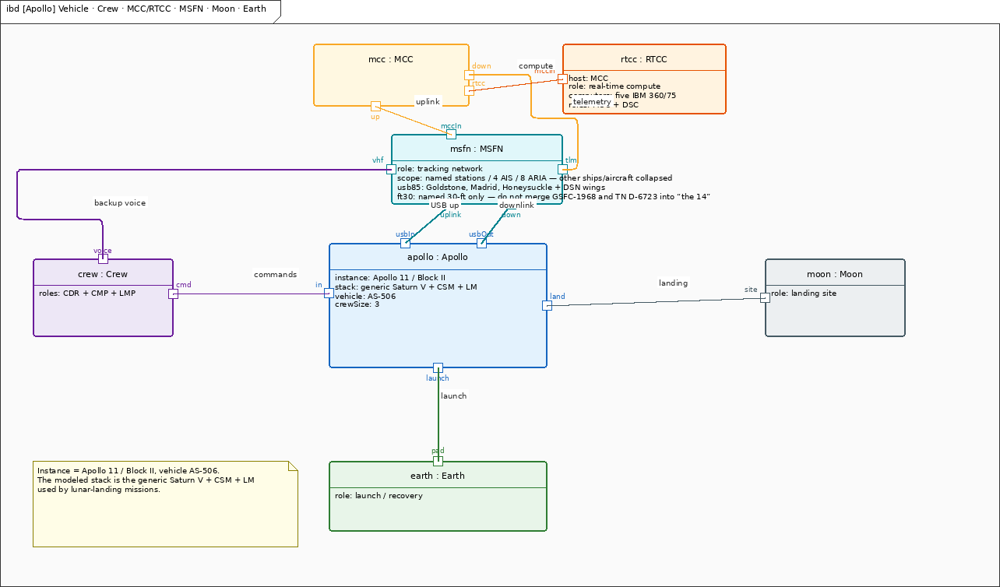

**Figure. `apollo-ctx.png`.** Look at the vehicle in the middle, Houston and the tracking net above it, the crew to the left, Earth below, and the Moon to the right. USB carries the main link; VHF is the backup voice path.

Inside the stack: Saturn V (S-IC, S-II, S-IVB, IU), LES, SLA, CSM (CM + SM), LM-5 (descent + ascent). Ground facilities are first-class parts, not one Ground actor.

Kept distinct, not folded: two Apollo Guidance Computers (AGC) — `AGC_CM` Colossus / Comanche 055 + two Display and Keyboard (DSKY) units; `AGC_LM` Luminary 1A / LMY99 rev 001 + one DSKY; Abort Guidance System (AGS) = Abort Electronics Assembly (AEA) + Abort Sensor Assembly (ASA) + Data Entry and Display Assembly (DEDA), not a DSKY and not a landing computer; IU = Launch Vehicle Digital Computer (LVDC) + ST-124 + Flight Control Computer (FCC); no digital AGC↔LVDC; Entry Monitor System (EMS), independent of AGC; descent vs ascent; SM fuel cells vs CM silver-zinc (AgZn) vs LM AgZn; SM RCS quads vs CM dual 6-engine sets; USB vs VHF / High Frequency (HF) backup; RSO/AFETR outside MCC; crew as three parts.

The mission need is lunar-orbit rendezvous: boost and TLI on Saturn, dock and extract the LM, coast translunar, LOI, land, EVA, ascent, rendezvous, TEI, entry, and recovery. There is no stage-to-stage Launch Vehicle (LV) electrical power on Saturn, and no CSM–LM propellant crossfeed.

The ground family-tree view (`apollo-gnd-bdd.png`) was reflowed and came out more than eight thousand pixels wide. That figure is omitted from the story until it is readable. RSO and USS *Hornet* already sit on the model and on the context / recovery prose above; they were not added as new parts.

## 2. Requirements and use cases

A requirement is a shall. The requirements diagram is the widget that holds those promises in one place. Crew Safety is **Not LES-only**. Food is a 1967 plan printed in a 1974 technical note, not a flown calorie count (Smith et al., 1974).

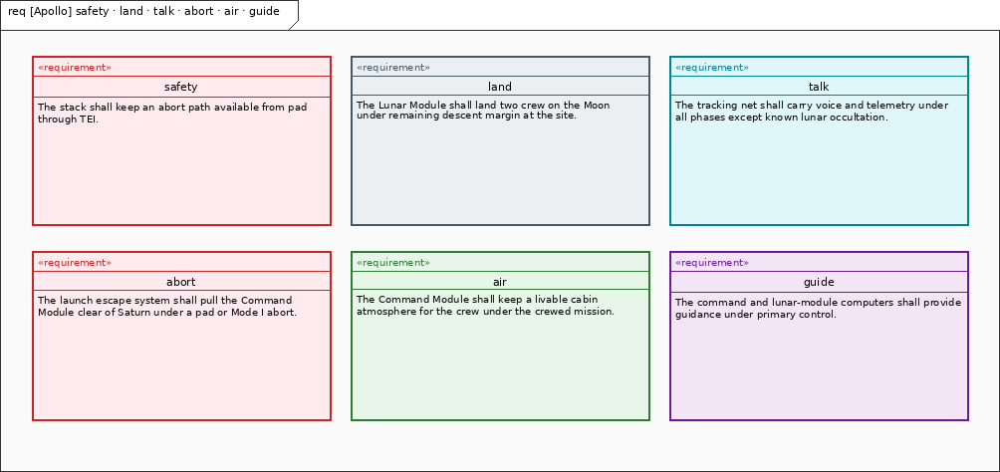

**Figure. `apollo-req.png`.** Each box is a shall or a sourced constraint. Read Crew Safety first: abort is a family of doors, not one tower rocket.

`Apollo.crewSafetyRequirement` (REQ-001) says an abort path shall remain available from pad through TEI. **Not LES-only.** `Apollo.landingRequirement` (REQ-002) says the LM shall land with remaining descent Δv margin at the site. Margin is required; an official CSM lunar Δv table is not filled. `Apollo.commsContinuityRequirement` (REQ-003) says USB / MSFN shall carry voice and telemetry except known lunar occultation. `Apollo.lesAbortRequirement` (REQ-004) says LES shall pull the CM clear of Saturn on a pad or Mode I abort.

`Apollo.eclssRequirement` (REQ-005) is cabin atmosphere on the vehicle, not a biomedical model. Command Module Environmental Control System (ECS) / Environmental Control and Life Support System (ECLSS): 3 crew / 14 d spec; 5.0 psia 100% O2; CO2 ≤7.6 torr; SM O2 640 lb; potable 36 lb / waste 56 lb; LiOH 1.5 man-day, swap 12 h. The A11 mission is 196 h against a 336 h spec. `Apollo.guidanceRequirement` (REQ-006) says AGC_CM and AGC_LM shall provide Guidance, Navigation, and Control (GNC); AGS is the LM abort backup.

`Apollo.usbRfRequirement` (REQ-007) is sourced Radio Frequency (RF): CSM 2106.40625 ↑ / 2287.5 Phase Modulation (PM) ↓ / 2272.5 Frequency Modulation (FM); LM 2101.802 ↑ / 2282.5. Pulse-Code Modulation (PCM) 51.2 or 1.6 kbps. Uplink digital ~2 kbps. Pseudo-Random Noise (PRN) range 992 kbps, ±15 m, ~540,000 mi unambiguous. `Apollo.p27Requirement` (REQ-008) limits P27 uplink verbs to V70–V73 into the Command Module Computer (CMC) / LM Guidance Computer (LGC). Path A is the Command, Communications, and Telemetry System (CCATS) load. Path B is P27.

`Apollo.foodRequirement` (REQ-009) is the **D-7720 April 1967** plan baseline: **2800 kcal/man/day CM**, **3200 kcal/man/day LM**, mass 2.26 lb/man/day planned (Smith et al., 1974). That 1967 plan year lives inside the 1974 document. It is not A11 flown intake. A11 actual kcal still UNKNOWN. `Apollo.lmEcsRequirement` (REQ-010) sources LM-5 ECS: descent O2 ~48 lb at a **2,800 psi** teaching figure (less conservative / schematic). NASA TN D-6724 also prints **3,000 psi** (NASA, 1972). No required pressure. Ascent O2 ~2.4 lb ×2; descent water 332 lb; ascent water 42 lb ×2; Liquid Cooling Garment (LCG) 1200 Btu/man-h steady.

There is no formal use-case package. The stakeholder stories are the mission itself: fly the timeline, abort if the timeline breaks, land, walk, come home.

## Solution domain

Once the shalls are on the table, the stack can be named. Structure is who owns which engine. Behavior is the clock. Parametrics are the sourced numbers, including the fights the sources did not settle. Allocations close the loop.

## 3. Structure

A block definition diagram (BDD) is a family tree. An IBD is the same family sitting in their seats. The system BDD and the Saturn V BDD still draw composition lines through attribute text after reflow, so those two figures are omitted here. The Saturn V IBD is the readable stack picture.

The pad stack, read from the ground up, is S-IC-6, S-II-6, S-IVB-6N, IU-6, SLA-14 (8 panels: 4 jettison / 4 stay; LM-5), SM (owns the Service Propulsion System (SPS)), CM, LES. **SPS is on the SM, not the CM.** Composition is `Apollo.SM` → `Apollo.SPS`. Do not hang SPS on the command module.

The Saturn V IBD is the widget that shows adjacent joints only. Connections are not allowed to pass over boxes.

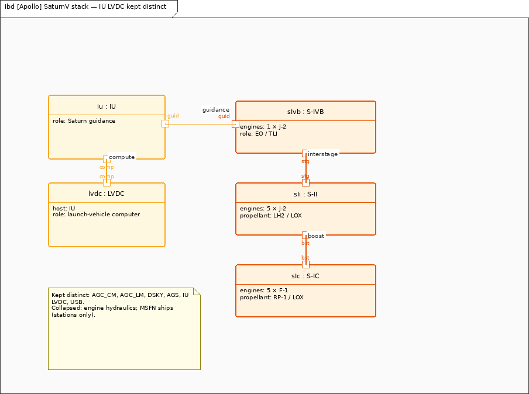

**Figure. `apollo-sat-ibd.png`.** Three stages and the IU, stacked the way they sat on the pad. No stage-to-stage LV electrical power.

F-1 1,530,000 lbf is the **SA-507** per-engine citation, not an AS-506 requirement. AS-506 S-IC liftoff remains 7,653,854 lbf (NASA, 1969, p. 109).

Landing Radar (LR) is on the LM descent stage only (three-beam, P63–P64). Composition is `Apollo.Descent` → `Apollo.LandingRadar`. Rendezvous Radar (RR) is on the ascent stage only. Composition is `Apollo.Ascent` → `Apollo.RendezvousRadar`. Primary Guidance and Navigation System (PNGS) is the cockpit switch label for Primary Guidance, Navigation and Control System (PGNCS). PNGS stays on the LM; AGC_LM stays under PNGS. Do not nest rendezvous radar in PNGS.

The CSM and LM internal views still carry crossing lines and stacked port text, so they are omitted from the story until those layouts are clean. The facts they were meant to show are in the sentences above: **SPS is on the SM**; LR is descent-only; RR is ascent-only.

AGS is its own small computer, not a spare DSKY. A BDD is the right widget when the job is to name the three boxes and keep DEDA off the DSKY list.

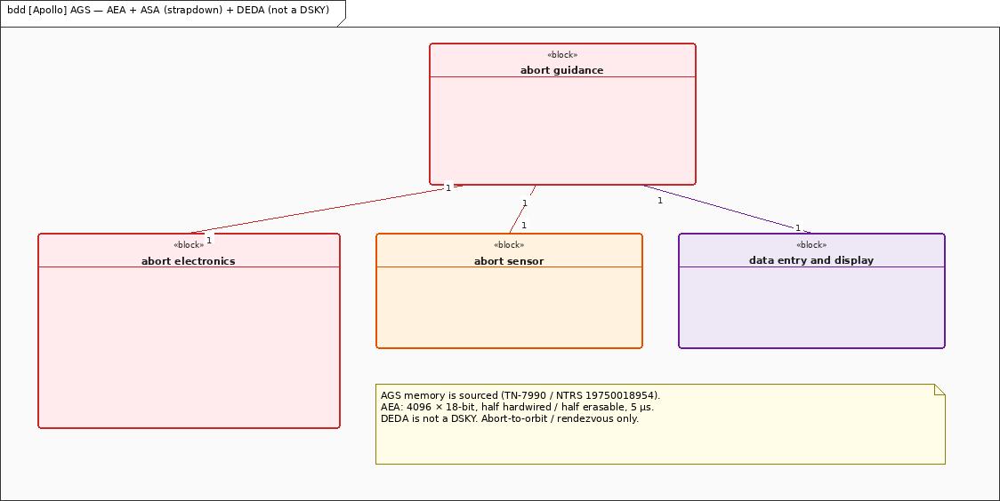

**Figure. `apollo-ags-bdd.png`.** AEA + ASA (strapdown) + DEDA (not a DSKY). AEA memory 4096×18, 5 µs, 32.7 lb (Kurten, 1975).

Guidance computers stay separate. IU LVDC owns boost + TLI (82.03125 µs, 26+2 bits). No digital path from AGC to LVDC. AGC_CM (Block II, 2048 E / 36864 F, 11.7 µs, Comanche 055 + 2 DSKY) owns LOI / TEI / entry (P61–P67). AGC_LM (Luminary 1A + 1 DSKY) owns landing / ascent / LM abort (P63–P68 land; P70 Descent Propulsion System (DPS) / P71 Ascent Propulsion System (APS)). APS here is the LM Ascent Propulsion System, not S-IVB ullage (also historically called APS). AGS is abort-to-orbit / rendezvous only.

The GNC package diagram and the electrical / crew / ground IBDs still clip or overlap after the layout pass. They are omitted here. Electrical power in prose: SM three fuel cells on A11 with 2 H2 + 2 O2 cryo; CM three AgZn + Lower Equipment Bay (LEB) charger + separate pyro; LM four descent + two ascent AgZn with an Electronic Control Assembly (ECA) on each battery.

Command paths stay distinct. Path A is Flight Controller (FC) → Command Control Console (CCC) → RTCC → CCATS → site 642B → USB 70 kHz. Path B is P27 V70–V73 into CMC/LGC. VHF backup is 296.8 / 259.7 MHz (CSM–LM–EVA). Recovery beacon is 243.0 MHz, 3 W, 2 s on / 3 s off.

A comms IBD is the widget for radios and antennas, not for engines.

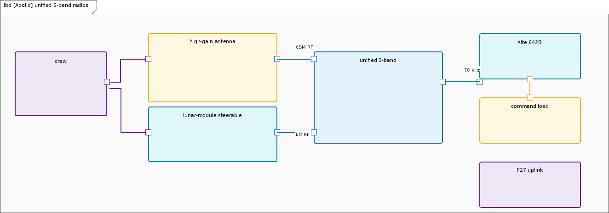

**Figure. `apollo-usb.png`.** Sourced RF and crew-selected antennas. P27 is not CCATS. Path A and Path B stay apart.

Docking hardware: CM probe, LM drogue, twelve ring latches. Soft dock then hard dock; hardware removed for transfer.

RCS is the small-thruster family. SM / LM 100 lbf (NASA, 1969, pp. 93, 106). CM dual 6-engine 93 lbf. Loaded SM RCS mass and loaded CM RCS mass stay UNKNOWN.

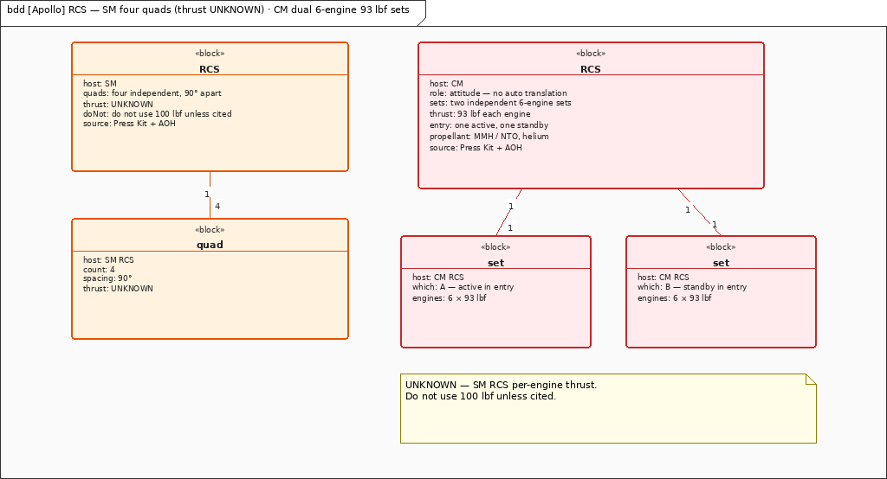

**Figure. `apollo-rcs.png`.** SM and LM at 100 lbf; CM dual 6-engine 93 lbf. Loaded mass is not filled.

The Portable Life Support System (PLSS) and Oxygen Purge System (OPS) ride on CDR and LMP for EVA only. OPS is the EVA Oxygen Purge System, not operations.

## 4. Behavior

A state machine (STM) is the widget for a plot that cannot skip a beat. Confirm `dockEject` sits between TLI and translunar. Do not draw TLI → translunar. Do not draw `dockEject` → LOI. The locked path is TLI → dockEject → translunar → LOI.

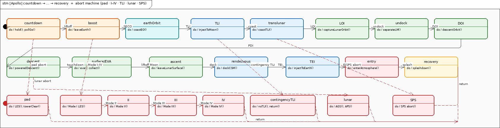

**Figure. `apollo-stm.png`.** Read left to right, then wrap: countdown → boost → earthOrbit → TLI → dockEject → translunar → LOI → undock → DOI → descent → surface/EVA → ascent → rendezvous → TEI → entry → recovery. Trigger words sit tight on the arrows; the path in this caption is the one that is locked.

`dockEject` is its own state (CMP-owned, SM RCS, probe-drogue). An activity diagram is the widget for the same phases as a start-to-recovery flow, without pretending to be a clock.

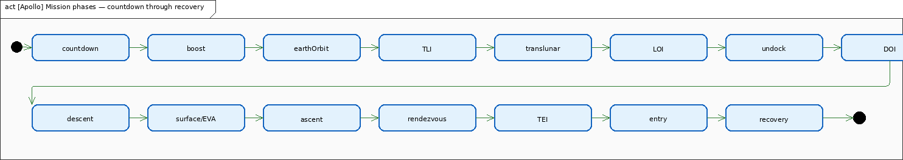

**Figure. `apollo-act.png`.** Same phase list as a control flow. Functional, not GET.

A sequence diagram is the widget for one close-up. Docking is probe, drogue, soft capture, twelve latches, stow, transfer.

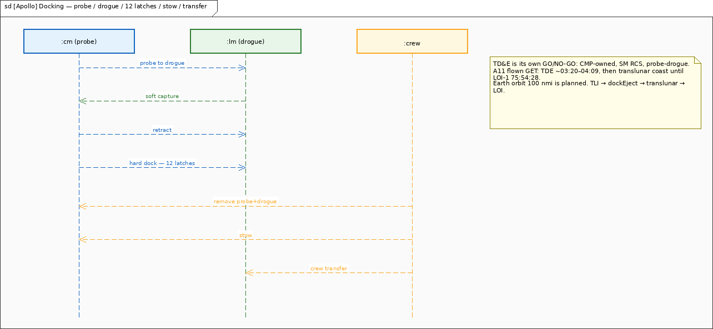

**Figure. `apollo-dock.png`.** Soft dock then hard dock. Hardware comes out so the crew can move.

GET: distinguish **planned** vs **flown**. Earth orbit **100 nmi is planned**. TLI has **three labeled numbers** (do not collapse): Press Kit **planned** `02:44:15` (NASA, 1969); A11-FP **planned** `2:44:26` (NASA Manned Spacecraft Center, Flight Planning Branch, 1969); **flown** `02:44:16` (MSC-00171; NASA, 1969, November). Transposition, Docking, and Ejection (TDE) `~03:20–04:09` GET is **planned**, not flown. LOI-1 has **two strings only**: `75:54:28` GET is **A11-FP planned**; **flown** LOI-1 is `~075:49:50` GET (PAD/MR). Do **not** call TLI `02:44:15`, TDE, or LOI-1 `75:54:28` flown. Splash `195:18:35` is the **flown GET**. 13 nmi is from USS *Hornet*, not from the target. The weather-revised miss was ~1.7 nmi. P66 Rate of Descent (ROD) as the A11 landing program is a separate flown-program mark, not a GET clock.

The abort STM still places some triggers on box borders, so that figure is omitted. Abort in prose: pad/LES, Modes I–IV, contingency TLI, SPS abort, lunar abort (P70 DPS / P71 APS). Crew Safety ≠ LES-only.

CMC P61–P67 is entry only. LGC P63–P68 is landing only (A11 flew P66 ROD). Do not share one P-number STM. The CMC entry STM still clips labels, so it is omitted. The LGC landing STM is the readable program picture.

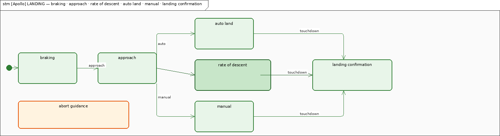

**Figure. `apollo-lgc-stm.png`.** P63–P68 LANDING. A11 flew P66 ROD.

Handoff is Mission Rule 1-21 at umbilical-tower clear. RSO ≠ MCC; RSO owns destruct until orbital safing.

A landing sequence is the widget for the human chain: MCC → MSFN → USB → AGC_LM / CDR / radar / DPS.

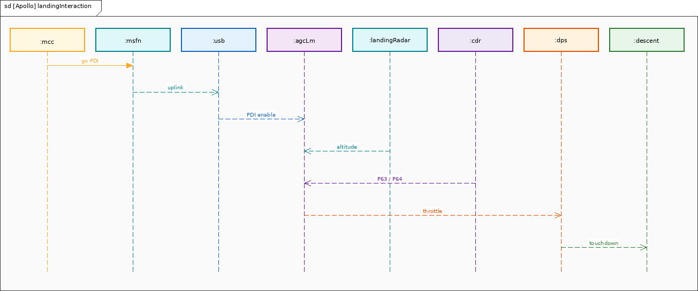

**Figure. `apollo-seq.png`.** Houston speaks. The network carries the words. The LM computer and the Commander fly the last miles.

Uplink has two doors. A command sequence is the widget that keeps Path A and Path B from becoming one arrow.

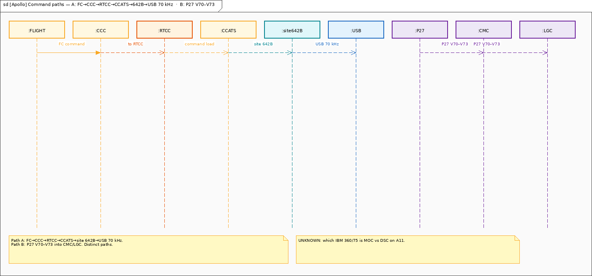

**Figure. `apollo-cmd.png`.** Path A FC→CCC→RTCC→CCATS→642B→USB 70 kHz; Path B P27 V70–V73.

The ECLSS activity and parametric views still overlap after the layout pass. Cabin loop and sourced numbers stay in the prose of sections 2 and 5.

## 5. Parametrics

Numbers in this paper come from NASA pages a reader can still open. Conflicts stay **UNRECONCILED** — cite both, no silent winner. Four fights stay dual-cites: Press Kit p. 109 tank and stage loads, not a closed mass budget (NASA, 1969); two SPS vacuum thrusts; three DPS thrust cites; descent O2 teaching 2,800 psi with a mention of 3,000 psi (NASA, 1972).

A11 Press Kit p. 109 tank loads and launch masses unless noted. **UNRECONCILED** — same flag as Δv. These are sourced stage loads, **not a closed mass budget**. S-IC (AS-506 / S-IC-6) 7,653,854 lbf liftoff / 5,022,674 lb fueled. F-1 per engine 1,530,000 lbf is the **SA-507** citation, not an AS-506 requirement. S-II 1,059,171 lb (S-II-6). S-IVB 260,523 lb (S-IVB-6N). IU 4,306 lb (IU-6). CM 12,250 lb. SM 51,243 lb. LM-5 33,205 lb. DPS load 18,100 lb. APS load 5,214 lb. LM RCS 604 lb; 100 lbf/engine (NASA, 1969, p. 106). SM RCS 100 lbf/engine (NASA, 1969, p. 93). CM RCS 93 lbf/engine, two 6-engine sets. LES 8,930 lb. AGC Block II 2048 E / 36864 F, 11.7 µs, 65 lb / 70 W. AEA 4096 × 18-bit, 5 µs, 32.7 lb (Kurten, 1975). APS thrust 3,500 lbf, 1.5° cant, not gimbaled (NASA, 1973, March). PLSS 4 h / 1.04 lb O2. CDR EVA 2:48 / LMP 2:40 is **TN D-8093 Table I** (Lutz et al., 1975). That is not the PAO hatch-to-hatch 2:31:40.

SPS vacuum thrust is **minutiae**, not a required thrust: cite both Press Kit **20,500 lbf** (NASA, 1969) and TN D-7375 **21,500 lbf vac** (NASA, 1973, August). DPS has **three** sourced figures and no shall — do not pick a winner: Press Kit **9,870 / 1,050–6,300** lbf (NASA, 1969); TN D-7143 **10,500** lbf and **10:1** (NASA, 1973, March); LMA790 **9,870 / 1,050–6,800** lbf. LMA790 stays unmarked as a full cite; title and date are not in hand. A required-thrust number is not invented. Descent O2 teaching figure is **2,800 psi** (less conservative / schematic). TN D-6724 also prints **3,000 psi** (NASA, 1972). No required pressure — not an equal dual-cite.

Fuel-cell wattage is not in the press kit. A secondary National Air and Space Museum (NASM) band is noted on the fuel-cell block and is not promoted to a requirement. Apollo Guidance Computer Information Series (AGCIS) 30 stays unmarked as a cite; title and date are not in hand.

## 6. Allocations

A shall without an owner is a poster. Crew Safety is allocated to LES (pad / Mode I only), SPS (SPS abort), DPS (P70), APS (P71), AGS (lunar abort backup), ECLSS, and CM RCS. Landing is allocated to Descent (DPS stage). Comms Continuity is allocated to USB and MSFN. LES Abort is allocated to LES. Cabin Atmosphere is allocated to ECLSS. Guidance is allocated to AGC_CM, AGC_LM, and AGS. USB RF is satisfied by USB. P27 uplink verbs are satisfied by P27.

Food plan and LM-5 ECS are on the model as requirements; they do not have `allocate` edges. Treat them as sourced constraints on ECLSS / LM-5, not as invented allocations.

Design bindings that the structure already states: boost/TLI → IU LVDC; LOI/TEI/entry → AGC_CM; landing/ascent/LM abort → AGC_LM with AGS backup (AGS does not land); EVA portable loop → PLSS on CDR/LMP only; trajectory/uplink compute → RTCC; launch commit → KSC; destruct → RSO; heat shield → CM only.

## 7. Open risks / unmarked

Left unmarked on purpose. Do **not** invent:

- Official CSM lunar Δv table
- CSM-107 SPS loaded mass
- Loaded SM RCS propellant mass
- Loaded CM RCS propellant mass
- A11 AGS flight-program name
- A11 actual kcal
- RTCC Mission Operations Computer (MOC) vs Dynamic Standby Computer (DSC) assignment on A11
- 4th Apollo Instrumentation Ship (AIS) identity
- Entry blackout duration
- Full 30-ft MSFN map

F-1 1,530,000 lbf stays the SA-507 per-engine citation. Do not promote it into an AS-506 requirement. AS-506 S-IC liftoff remains 7,653,854 lbf (NASA, 1969, p. 109).

Descent O2 teaching figure is **2,800 psi** (less conservative / schematic). TN D-6724 also prints **3,000 psi** (NASA, 1972). No required pressure. Tank loads stay **UNRECONCILED**, same flag as Δv. SPS vacuum thrust is minutiae: 20,500 lbf (PK) and 21,500 lbf vac (TN D-7375) — no required thrust. DPS cites all three (PK 9,870 / 1,050–6,300; D-7143 10,500 / 10:1; LMA790 9,870 / 1,050–6,800) — no shall, no winner.

## Generated views

Figures that appear above are the ones a reader can actually read. The file map below marks what was used and what was left out after the vision pass. Omitted views were not deleted from the folder; they are not asked to carry the story until a later layout pass makes them readable.

Used in the story: `apollo-sa506-rollout-69-HC-620.jpg`, `apollo-ctx.png`, `apollo-req.png`, `apollo-sat-ibd.png`, `apollo-ags-bdd.png`, `apollo-usb.png`, `apollo-rcs.png`, `apollo-stm.png`, `apollo-act.png`, `apollo-dock.png`, `apollo-lgc-stm.png`, `apollo-seq.png`, `apollo-cmd.png`.

Omitted from the story after vision-check (reflow attempted; still hard to read or still crossing text): `apollo-gnd-bdd.png` (8452 px wide after a one-row station pack), `apollo-bdd.png` and `apollo-sat-bdd.png` (attribute text still under composition lines), `apollo-ibd.png` (stacked port labels on vertical joints), `apollo-csm-bdd.png`, `apollo-csm.png`, `apollo-lm-bdd.png`, `apollo-lm.png`, `apollo-gnd.png`, `apollo-crew.png`, `apollo-eps.png`, `apollo-gnc-pkg.png`, `apollo-eclss.png`, `apollo-eclss-par.png`, `apollo-abort.png`, `apollo-cmc-stm.png`. No new RSO, Hornet, or other parts were invented to fill those pictures.

```bash
msml-validate-all projects/apollo --strict
msml-render-all projects/apollo
```

## References

Kurten, P. M. (1975, July). *Abort Guidance System* (NASA TN D-7990). National Aeronautics and Space Administration.

Lutz, C. C., et al. (1975, November). *Development of the Extravehicular Mobility Unit* (NASA TN D-8093). National Aeronautics and Space Administration.

National Aeronautics and Space Administration. (1969). *Apollo 11 press kit* (Release No. 69-83K).

National Aeronautics and Space Administration. (1969, May 20). Photograph 69-HC-620 [Photograph]. Public domain.

National Aeronautics and Space Administration. (1969, November). *Apollo 11 mission report* (MSC-00171).

National Aeronautics and Space Administration. (1972). *Apollo Experience Report: Lunar Module Environmental Control Subsystem* (NASA TN D-6724).

National Aeronautics and Space Administration. (1973, March). *Apollo Experience Report: Ascent Propulsion System* (NASA TN D-7082).

National Aeronautics and Space Administration. (1973, March). *Apollo Experience Report: Descent Propulsion System* (NASA TN D-7143).

National Aeronautics and Space Administration. (1973, August). *Apollo Experience Report: Service Propulsion Subsystem* (NASA TN D-7375).

NASA Manned Spacecraft Center, Flight Planning Branch. (1969, July 1). *Apollo 11 flight plan* (Final).

Smith, M. C., et al. (1974, July). *Food systems* (NASA TN D-7720). National Aeronautics and Space Administration.
