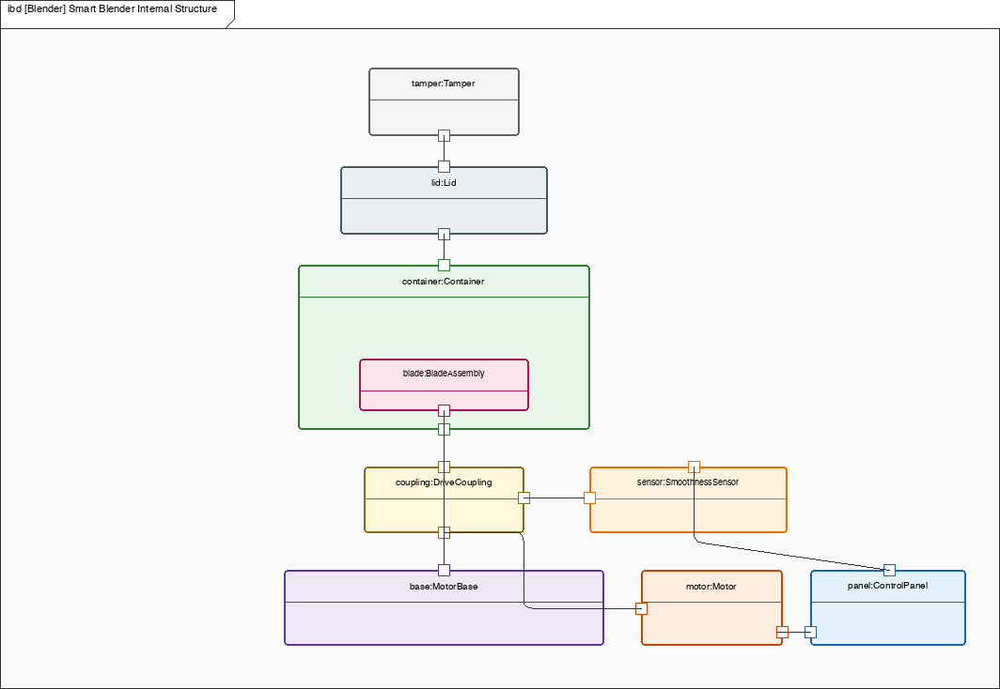

# Smart Blender — Architecture / System Design

High-performance countertop blender used to exercise IBD, activity, and state-machine views. Namespace `Blender`. File stem `blender`. This note is the design argument for the model in this folder.

The same appliance idea appears in SysML2d. The files are not interchangeable. Numbers below are only those already on `blender-model.msml`. There are none filled.

## 1. Purpose / context

The blender exists to run a smoothie program: the user loads ingredients, seats the container, closes the lid, starts the program, and the machine spins until a smoothness estimate says stop — or the user stops it, a timeout fires, or power goes off.

This is an example model for language coverage, not a certifiable appliance.

## 2. System boundary and actors

**Inside:** MotorBase, Motor, DriveCoupling, Container, BladeAssembly, Lid, Tamper, ControlPanel, SmoothieCompleteSensor.

**Outside:** User. Mains power is implied by the Off / Ready switch; there is no Power Grid actor on this model.

There are no formal use-case definitions on `blender-model.msml`. The intended operator story is start / stop / power off, recovered from the activity and STM views.

## 3. Requirements

This MSML blender has **no requirement definitions**. There are no requirement ids, shall-statements, or numeric performance targets on the model.

Design intent that *is* on the model:

- ControlPanel exposes variable speed, pulse, and a smoothie program flag.
- SmoothieCompleteSensor estimates texture from load and vibration proxies (`loadProxy`, `vibrationProxy`, `textureEstimate`).
- The blender block holds `program` and `smoothnessThreshold` as typed properties without filled product values.

No lid-disable time is bound. Lid seating is the mechanical `lid seats on container` connector and the activity step `Secure lid` — event names only.

## 4. Structure and interfaces

Command / drive / sense path:

- ControlPanel `motorCommand` (out) → Motor `cmd` (in)
- Motor `drive` (out) → DriveCoupling `driveIn` (in)
- DriveCoupling `driveOut` (out) → BladeAssembly `drive` (in)
- DriveCoupling `vibrationProxy` (out) → SmoothieCompleteSensor `vibrationProxy` (in)
- SmoothieCompleteSensor `complete` (out) → ControlPanel `complete` (in)

Mechanical seats:

- MotorBase `mechanical` ↔ Container `mechanical` (container on base)
- Lid `containerSeat` ↔ Container `lidSeat`
- Tamper `lidOpening` ↔ Lid `tamperOpening` (tamper through the lid)

## 5. States and modes

SmoothieProgram: Off → Ready (`on switch`) → Blending (`start command`).

From Blending: `smoothie complete`, `stop command`, or `timeout` return to Ready. `off switch` from Ready or Blending returns to Off.

There is no Error state. Lid and power events that exist: `on switch`, `start command`, `smoothie complete`, `stop command`, `timeout`, `off switch`. No lid-open or overcurrent effect is modeled.

## 6. Allocations (req → part)

None. The model has no `allocate` or `satisfy` relationships and no verification names.

## 7. Sourced numbers

None filled. `speed: RPM` and `smoothnessThreshold: Real` are types, not values. Do not promote view-only values into the model.

## 8. Open risks / TBD

- This stays an example model, not a certifiable appliance.
- No requirements, so nothing is allocated to Motor, ControlPanel, or the sensor.
- Lid has a seat port and `Secure lid` / `lid seats on container` events only — no disable-time, no interlock requirement.
- Motor exists; no filled power, and no overcurrent effect.
- No Error state and no mains / thermal analysis.

## 9. Views in this folder

`blender-ibd.png`, `blender-act.png`, `blender-stm.png`.



```bash
msml-validate-all projects/appliances/blender --strict
msml-render-all projects/appliances/blender
```
