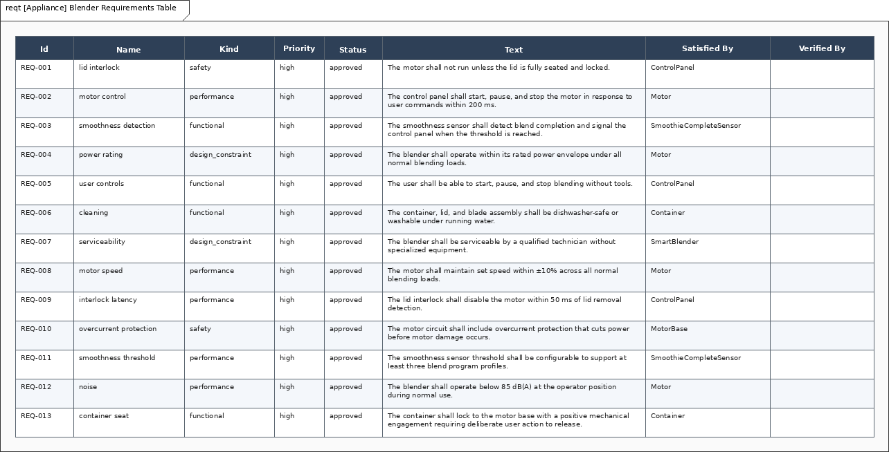

# Smart Blender — Architecture / System Design

High-performance countertop blender used to exercise IBD, activity, state-machine, and requirement views. Namespace `Blender`. File stem `blender`. This note is the design argument for the model in this folder.

The same appliance idea appears in SysML2d (`examples/blender/blender.sysml` at SHA `e0e45b2`). The files are not interchangeable. Pick one toolchain. Numbers below are only those already on `blender-model.msml`.

## 1. Purpose / context

The blender exists to run a smoothie program: the user loads ingredients, seats the container, closes the lid, starts the program, and the machine spins until a smoothness estimate says stop — or the user stops it, a timeout fires, or power goes off.

This is an example model for language coverage, not a certifiable appliance.

## 2. System boundary and actors

**Inside:** MotorBase, Motor, DriveCoupling, Container, BladeAssembly, Lid, Tamper, ControlPanel, SmoothieCompleteSensor.

**Outside:** User. Mains power is implied by the Off / Ready switch; there is no Power Grid actor on this model.

There are no formal use-case definitions on `blender-model.msml`. The intended operator story is start / stop / power off, recovered from the activity and STM views.

## 3. Requirements

Thirteen sibling shalls bound from SysML2d `blender.sysml`. No extras.

| Id | Name | Text / numbers |
| --- | --- | --- |
| `Blender.lidInterlockRequirement` | lid interlock | Motor shall not run unless the lid is fully seated and locked. |
| `Blender.motorControlRequirement` | motor control | Start, pause, and stop within **200 ms**. |
| `Blender.smoothnessDetectionRequirement` | smoothness detection | Sensor detects completion and signals the control panel. |
| `Blender.powerRequirement` | power rating | Operate within the rated power envelope. No filled watts. |
| `Blender.userControlsRequirement` | user controls | Start, pause, and stop without tools. |
| `Blender.cleaningRequirement` | cleaning | Container, lid, and blade dishwasher-safe or washable. |
| `Blender.serviceRequirement` | serviceability | Serviceable without specialized equipment. |
| `Blender.motorSpeedRequirement` | motor speed | Set speed within **±10%**. |
| `Blender.interlockLatencyRequirement` | interlock latency | Lid interlock disables the motor within **50 ms** of lid removal. |
| `Blender.overcurrentProtectionRequirement` | overcurrent protection | Cuts power before motor damage. |
| `Blender.smoothnessThresholdRequirement` | smoothness threshold | Configurable threshold; at least **three** blend program profiles. |
| `Blender.noiseRequirement` | noise | Below **85 dB(A)** at the operator position. |
| `Blender.containerSeatRequirement` | container seat | Positive mechanical lock to the base; deliberate release. |

## 4. Structure and interfaces

Command / drive / sense path:

- ControlPanel `motorCommand` (out) → Motor `cmd` (in)
- Motor `drive` (out) → DriveCoupling `driveIn` (in)
- DriveCoupling `driveOut` (out) → BladeAssembly `drive` (in)
- DriveCoupling `vibrationProxy` (out) → SmoothieCompleteSensor `vibrationProxy` (in)
- SmoothieCompleteSensor `complete` (out) → ControlPanel `complete` (in)

Mechanical seats:

- MotorBase `mechanical` ↔ Container `mechanical` (container on base)
- Lid `containerSeat` ↔ Container `lidSeat`
- Tamper `lidOpening` ↔ Lid `tamperOpening` (tamper through the lid)

## 5. States and modes

SmoothieProgram: Off → Ready (`on switch`) → Blending (`start command`).

From Blending: `smoothie complete`, `stop command`, or `timeout` return to Ready. `off switch` from Ready or Blending returns to Off.

The STM keeps Off / Ready / Blending. Lid interlock and overcurrent are requirements allocated to ControlPanel and MotorBase; they are not extra STM event names on this view.

## 6. Allocations (req → part)

Satisfy mappings on the model:

| Requirement | Satisfied by |
| --- | --- |
| lid interlock | ControlPanel |
| motor control | Motor |
| smoothness detection | SmoothieCompleteSensor |
| power rating | Motor |
| user controls | ControlPanel |
| cleaning | Container |
| serviceability | Blender |
| motor speed | Motor |
| interlock latency | ControlPanel |
| overcurrent protection | MotorBase |
| smoothness threshold | SmoothieCompleteSensor |
| noise | Motor |
| container seat | Container |

SysML2d allocation names kept where they map: `allocateInterlockToControlPanel`, `allocateTorqueToMotor`, `allocateSmoothnessToSensor`, `allocateCleaningToContainer`, `allocateProtectionToMotorBase`, `allocateInterfaceToControlPanel`.

## 7. Sourced numbers

Quantitative targets from SysML2d `blender.sysml` only:

- motor start / pause / stop within **200 ms**
- set speed within **±10%**
- lid interlock disables the motor within **50 ms**
- noise below **85 dB(A)** at the operator
- at least three blend program profiles

`speed: RPM` and `smoothnessThreshold: Real` are types, not values. Do not promote view-only watts or rpm into the model.

## 8. Open risks / TBD

- This stays an example model, not a certifiable appliance.
- No filled motor power, so electrical-load analysis cannot close.
- Lid seating is a mechanical connector plus the interlock shalls; the STM does not yet name `lidOpened` or `overcurrent`.
- No mains / thermal analysis.

## 9. Views in this folder

`blender-ibd.png`, `blender-act.png`, `blender-stm.png`, `blender-req.png`, `blender-reqt.png`.




```bash
msml-validate-all projects/appliances/blender --strict
msml-render-all projects/appliances/blender
```
