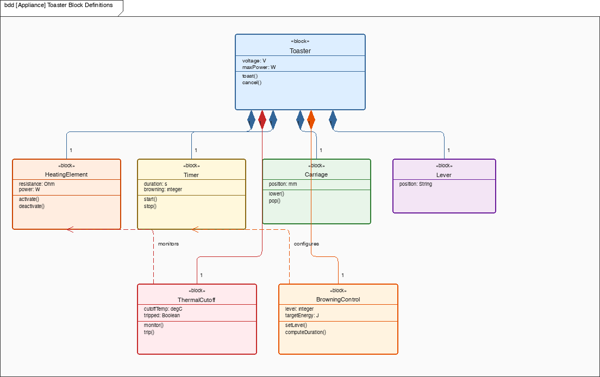
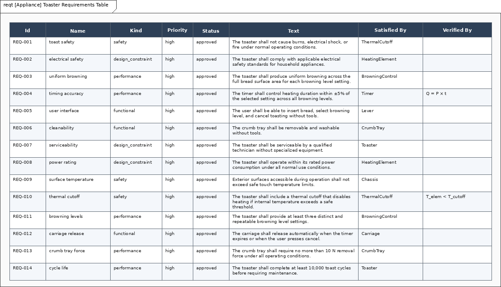

# Toaster — Architecture / System Design

Two-slice pop-up toaster used as the MSML coverage canary. Namespace `Toaster`. File stem `toaster`. This note is the design argument for the model in this folder, not a catalog of pictures.

The same appliance idea appears in SysML2d (`examples/toaster/toaster.sysml` at SHA `e0e45b2`). The files are not interchangeable. Pick one toolchain. Numbers below are only those already on `toaster-model.msml`. Unfilled types stay unfilled.

## 1. Purpose / context

The toaster exists to brown bread to a user-selected level and then present it. The design problem is a short, repeatable thermal cycle with a hard safety cutoff: heat the element, time the cycle, pop the carriage, and shut down if the element exceeds a safe threshold.

This is an example model for language coverage, not a certifiable appliance.

## 2. System boundary and actors

**Inside:** BrowningControl, Timer, Lever, Carriage, HeatingElement, ThermalCutoff, CrumbTray, Chassis.

**Outside:** User and Power Grid. Bread, toast, crumbs, and the kitchen air are implied by the toast cycle; they are not first-class actors on the MSML use-case view.

Use cases: Toast Bread (includes Activate Heating), Adjust Browning, Cancel Toast, Reset Error. The user associates with all four user-facing cases. The power grid associates with Toast Bread.

## 3. Requirements

Fourteen sibling shalls bound from SysML2d `toaster.sysml`. No containment or derive tree.

| Id | Name | Text / numbers |
| --- | --- | --- |
| `Toaster.toastSafetyRequirement` | toast safety | No burns, electrical shock, or fire under normal operating conditions. |
| `Toaster.electricalSafetyRequirement` | electrical safety | Comply with applicable household electrical safety standards. |
| `Toaster.browningRequirement` | uniform browning | Uniform browning across the full bread surface for each browning level. |
| `Toaster.timingRequirement` | timing accuracy | Timer within **±5%** of the selected setting across all browning levels. |
| `Toaster.userInterfaceRequirement` | user interface | Insert bread, select a browning level, and cancel without tools. |
| `Toaster.cleanabilityRequirement` | cleanability | Crumb tray removable and washable without tools. |
| `Toaster.serviceabilityRequirement` | serviceability | Serviceable by a qualified technician without specialized equipment. |
| `Toaster.powerRatingRequirement` | power rating | Operate within rated power consumption. No filled watts. |
| `Toaster.surfaceTemperatureRequirement` | surface temperature | Exterior surfaces stay within safe-touch limits. No filled °C. |
| `Toaster.thermalCutoffRequirement` | thermal cutoff | Thermal cutoff disables heating above a safe threshold. Threshold is unfilled. |
| `Toaster.browningLevelsRequirement` | browning levels | At least **three** distinct and repeatable browning level settings (**≥3**). |
| `Toaster.carriageReleaseRequirement` | carriage release | Carriage releases automatically when the timer expires or the user cancels. |
| `Toaster.crumbTrayForceRequirement` | crumb tray force | Crumb tray removal force **≤10 N**. |
| `Toaster.cycleLifeRequirement` | cycle life | At least **10,000** toast cycles before maintenance. |

Only the numbers in that table are bound.

## 4. Structure and interfaces

Toaster properties on the model are typed (`voltage: V`, `maxPower: W`) without filled product values.

Parts:

- `BrowningControl` — `level`, `targetEnergy`
- `Timer` — `duration`, `browning`
- `Lever` — `position`
- `Carriage` — `position`
- `HeatingElement` — `resistance`, `power`
- `ThermalCutoff` — `cutoffTemp`, `tripped` (`cutoffTemp: degC` typed, unfilled)
- `CrumbTray`
- `Chassis`

Connectors on the IBD:

- Lever `ctrl` → Timer `in`
- Timer `signal` → HeatingElement `ctrl`
- HeatingElement `heatSignal` → Carriage `heatSignal`

BrowningControl configures the Timer. ThermalCutoff monitors the HeatingElement.

## 5. States and modes

ToastingCycle: Idle → Toasting (`lever_down`) → Done (`timer_expired`) → Idle (`toast_removed`).

From Toasting: `lever_up` returns to Idle (cancel). `overheat_detected` goes to Error (deactivate element, release latch, alarm). Error → Idle on `reset`.

Done is a normal state, not a terminal node: toast can sit until the user removes it.

## 6. Allocations (req → part)

Satisfy mappings on the model:

| Requirement | Satisfied by |
| --- | --- |
| toast safety | ThermalCutoff |
| electrical safety | HeatingElement |
| uniform browning | BrowningControl |
| timing accuracy | Timer |
| user interface | Lever |
| cleanability | CrumbTray |
| serviceability | Toaster |
| power rating | HeatingElement |
| surface temperature | Chassis |
| thermal cutoff | ThermalCutoff |
| browning levels | BrowningControl |
| carriage release | Carriage |
| crumb tray force | CrumbTray |
| cycle life | Toaster |

Parametric properties on the model: `Energy` verifies timing accuracy; `SafetyCheck` (`T_elem < T_cutoff`, unfilled) verifies thermal cutoff. Activity steps (insert bread, press lever, start timer, heat, pop) allocate to the same parts.

## 7. Sourced numbers

Quantitative targets from SysML2d `toaster.sysml` only:

- at least three distinct and repeatable browning levels (**≥3**)
- crumb tray removal force **≤10 N**
- at least **10,000** toast cycles before maintenance
- timer within **±5%** of the selected setting across all browning levels

Root `voltage` and `maxPower` are typed, not filled. `cutoffTemp` is typed `degC`, not filled. Do not promote view-only values into the model.

## 8. Open risks / TBD

- This stays an example model, not a certifiable appliance.
- No filled mains voltage or element wattage, so electrical-load analysis cannot close.
- Thermal cutoff threshold stays an unfilled type; `SafetyCheck` compares `T_elem` to `T_cutoff` without a product number.
- Power is typed on Toaster / HeatingElement with no filled watts.
- Product-line variants are out of scope.

## 9. Views in this folder

`toaster-bdd.png`, `toaster-ibd.png`, `toaster-act.png`, `toaster-seq.png`, `toaster-stm.png`, `toaster-uc.png`, `toaster-req.png`, `toaster-reqt.png`, `toaster-par.png`, `toaster-pkg.png`, `toaster-alloc.png`, `toaster-amx.png`.





```bash
msml-validate-all projects/appliances/toaster --strict
msml-render-all projects/appliances/toaster
```
