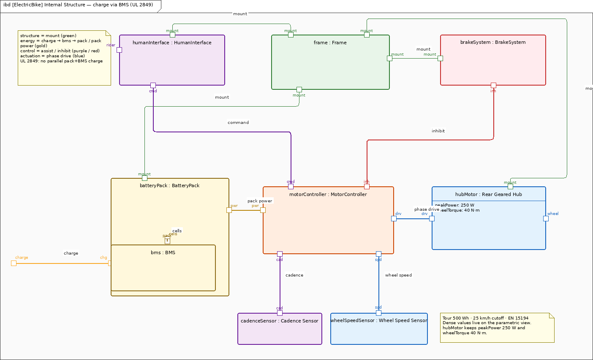
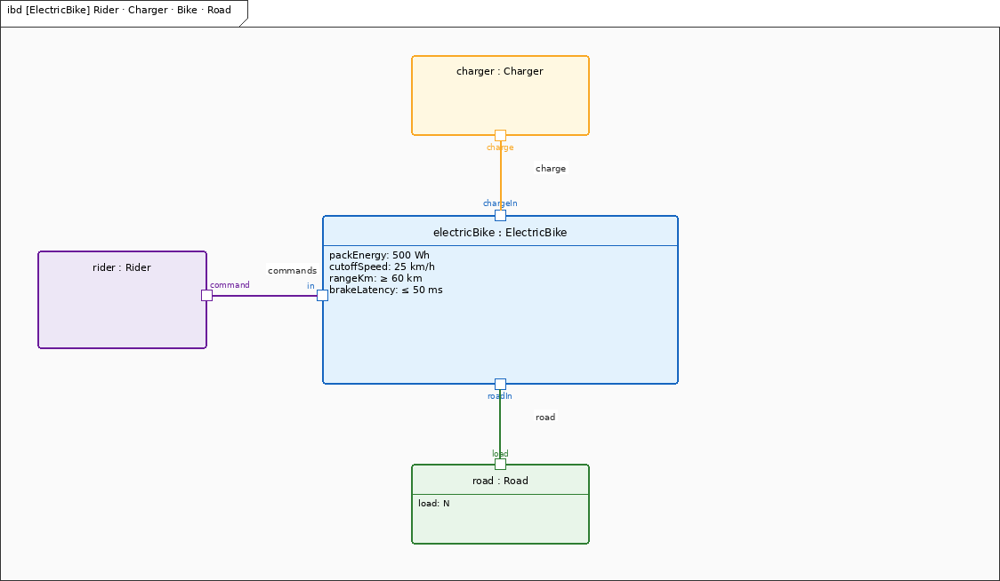
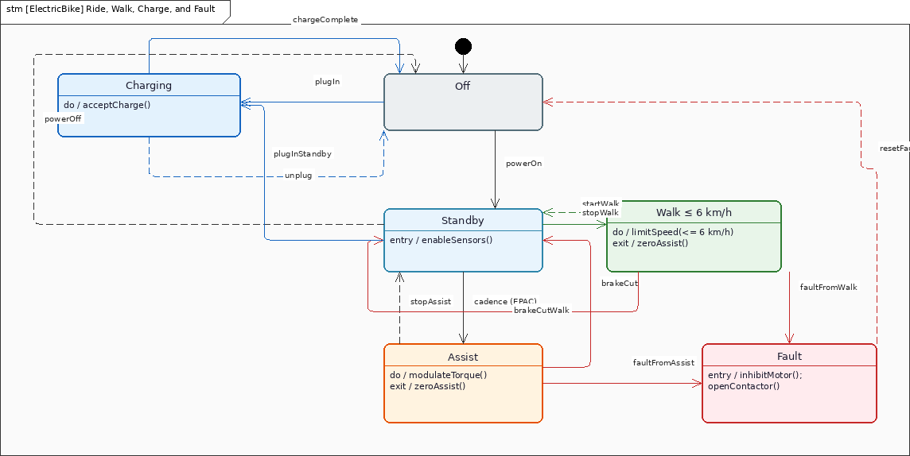

# Electric Bike Architecture Summary

EU-class pedal-assist bicycle (EPAC / EN 15194). Namespace `ElectricBike`. File stem `e-bike`. Context is rider / charger / bike / road only.

This is the publish hero. The same ElectricBike names appear in [SysML2d](https://github.com/meaningfulsystems/sysml2d); the files are not interchangeable.

## Parts

Frame, BatteryPack with nested `bms : BMS`, MotorController, Rear Geared Hub (id `HubMotor`), HumanInterface, BrakeSystem, `cadenceSensor`, `wheelSpeedSensor`.

Charge path (UL 2849): bike boundary `chargerIn` → nested BMS → pack cells. Rider, charger, and road stay on the context view, not the IBD.

## Key numbers

| Quantity | Value | Meaning |
| --- | --- | --- |
| Continuous assist | **250 W** | EU EPAC continuous rating (`continuousAssist`). Not peak power. |
| Hub torque | **40 N·m** | Hub **peak** torque (`peakTorque`). Not continuous. |
| Assist cutoff | 25 km/h | Cadence-only; no throttle. |
| Walk assist | ≤ 6 km/h | EPAC walk; not a throttle. |
| Pack energy | 500 Wh usable | Tour-mode range scenario (~8.3 Wh/km, 60 km). Not Eco / PAS-1. |
| Brake inhibit | 50 ms | Electronic cutoff order. EN 15194 stop is 5 m / 2 m. |
| Lighting | StVZO / ISO 6742 | Not UN ECE R113. |

## Views

| View | File | Story |
| --- | --- | --- |
| Context | `e-bike-ctx` | Rider · charger · bike · road |
| BDD | `e-bike-bdd` | Parts, nested BMS, sensors |
| IBD | `e-bike-ibd` | Internal structure; charge via BMS |
| STM | `e-bike-stm` | Off / Standby / walk / Assist / charging / Fault |
| Activity | `e-bike-act` | Start ride; Pedal (EPAC) |
| Sequence | `e-bike-int` | Rear Geared Hub lifeline |
| Use case | `e-bike-uc` | Rider on Ride + Adjust; Charger on Charge only |
| Requirements | `e-bike-req` · `e-bike-reqt` | Sibling requirements |
| Parametric | `e-bike-par` | Tour energy / range / brake limits |
| Package | `e-bike-pkg` | Model packages |
| Allocation | `e-bike-alloc` · `e-bike-amx` | Assist Limit → `wheelSpeedSensor` |







## Validate and render

```bash
msml-validate-all projects/e-bike --strict
msml-render-all projects/e-bike
```
