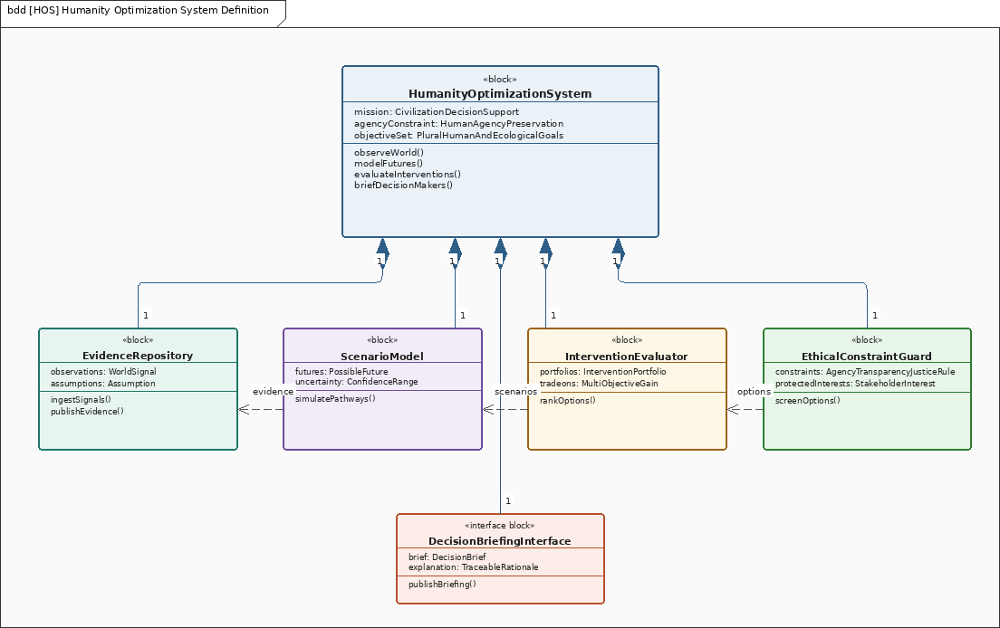
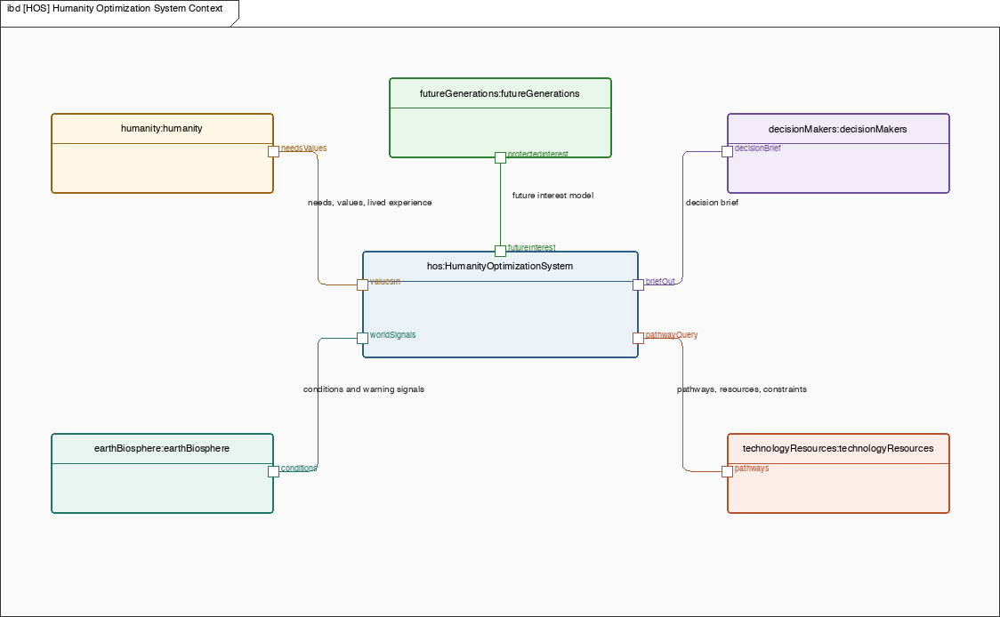
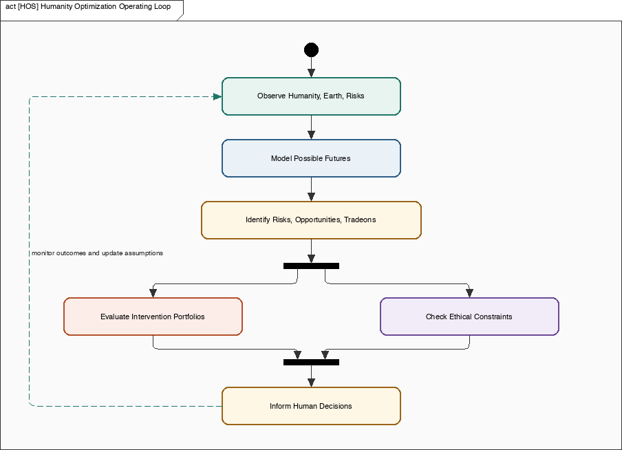
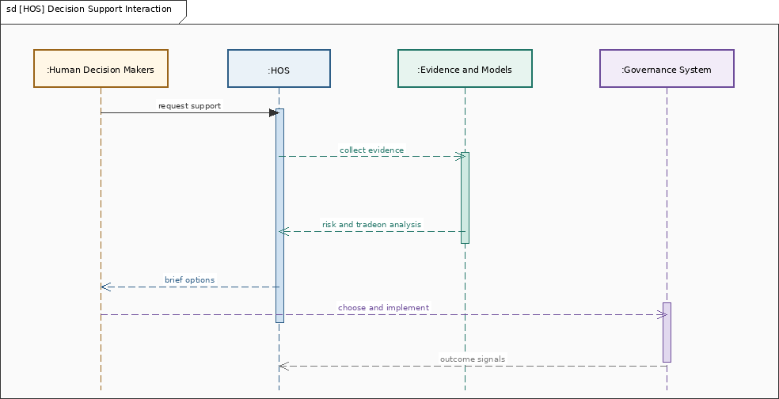

# The World as a System Optimization Problem: An Operational Concept

The last year, since starting Meaningful Systems, I have been thinking more and more about the whole world as being within scope of systems thinking. That sounds too big at first. It sounds like the kind of thing no one should try to model because the world is too complex, too political, too emotional, too nonlinear, and too full of people who see things differently.

But as a systems engineer, that is exactly why I think we need better models.

When a system is simple, people can often reason about it directly. When a system gets large enough, connected enough, and consequential enough, we need diagrams, abstractions, scenarios, assumptions, constraints, and feedback loops. We need a way to see the whole system without pretending we understand every detail.

That is the idea behind the Humanity Optimization System, or HOS.

HOS is not an AI ruler, a world government, or a machine for telling everyone how to live. It is a decision-support concept for helping humanity understand itself, Earth, technology, resources, risks, opportunities, and future generations as parts of one connected system.

The goal is not control. The goal is wiser human decision making.

## Why This Needs a Modeling Language

One thing I have learned from aerospace, commercial electronics, biomedical engineering, and other complex domains is that people can talk past each other for a very long time when they do not share a model.

So for this work, I created MSML: Meaningful Systems Modeling Language.

MSML is a new scriptable graphical modeling language created specifically for this purpose. It is derived from ideas in SysML and PlantUML, but it is aimed at a slightly different need: letting humans and AI generate clear, explicit, graphical system models as plain text files.

SysML gives us the systems engineering foundation: blocks, activities, sequences, requirements, state machines, parametrics, and the habit of treating structure and behavior as connected. PlantUML shows how powerful it can be when diagrams are scriptable, versionable, and easy to regenerate.

MSML combines those ideas into a JSON-based modeling format with a clean split between model and view. The `.msml` file contains the semantic model: blocks, actions, requirements, relationships, and other system meaning. The `.msmd` files contain the diagram views: layout, canvas, styling, and references back to the model. The result can be rendered into PNG images. In other words, it is not just a drawing. It is a model that can be scripted, reviewed, changed, regenerated, and eventually validated.

The MSML source code, renderer, language notes, and example models are published at [github.com/meaningfulsystems/msml](https://github.com/meaningfulsystems/msml).

For the Humanity Optimization System, that matters because the subject is too large for one static picture. We need many small views that can build up into a larger model of the world as a system.

## The System in Context

At the highest level, HOS sits between human decision makers and the large systems they are trying to understand: humanity, Earth, the biosphere, technology, resources, institutions, and the long future.

The block definition view defines HOS as a system made of evidence, scenarios, intervention evaluation, ethical constraint checking, and decision briefing.

The internal block view then treats that system as part of a larger context. Humanity, Earth and the biosphere, future generations, human decision makers, and technology/resource systems exchange information with HOS through explicit ports.

The system listens to human needs, values, and lived experience. It watches ecological and technological signals. It evaluates possible futures. It looks for risks, opportunities, tradeoffs, and tradeons.

A tradeoff is when improving one objective makes another objective worse. A tradeon is the opposite. It is when an intervention improves multiple objectives at once.

That is the key mental shift.

If the whole world is a system optimization problem, the first move should not be to accept every tradeoff as inevitable. The first move should be to look for tradeons. Where can health, climate, resilience, freedom, economic efficiency, ecological stability, and quality of life improve together?

Those are the places where good system design can matter the most.

## The Operating Loop

In practice, HOS would operate as a learning loop.

It observes the world, models possible futures, identifies risks and opportunities, evaluates intervention portfolios, checks ethical constraints, informs human decision makers, and then watches outcomes so the model can be updated.

This loop is important because the world is not a static optimization problem. It changes as people act. Technology changes. Climate changes. Institutions change. Values and priorities are debated. New evidence appears.

So HOS cannot be a one-time answer machine. It has to be a feedback system.

It should help answer questions like:

- What problem are we really solving?
- What are the coupled sub-problems?
- What constraints are physical, ethical, political, economic, or cultural?
- Where are we accidentally optimizing the wrong thing?
- Where are we treating a tradeon like a tradeoff?
- Who benefits, who pays, and who is not represented in the room?

The last question matters a lot, because future generations are part of humanity even though they cannot represent themselves today. Any serious model of human flourishing has to include people who do not exist yet but will inherit the consequences of our decisions.

## How Decision Support Would Work

In a normal scenario, human decision makers might ask for help on an issue like energy transition, land use, AI governance, food systems, catastrophic risk, or solar-system resource development.

HOS would gather evidence and scenarios, compare intervention portfolios, check ethical limits, and return options in a form people can debate and act on.

Notice the direction of authority in this picture. HOS briefs options. Humans choose and implement. Outcomes then flow back into the evidence base.

This is a critical design constraint.

The system should recommend, clarify, and support. It should not dominate, deceive, coerce, manipulate, or optimize one metric at the expense of human dignity.

If the system ever becomes a tool for reducing human agency, then it has failed its own purpose.

## What It Should Optimize For

I do not think humanity should optimize for only one variable. That is one of the traps. Human life is not just GDP, not just survival, not just carbon, not just happiness, not just efficiency, and not just technological progress.

The real objective function is plural.

HOS should help humanity reason about goals such as:

- reducing catastrophic and existential risk
- improving health and meaningful lives
- protecting the biosphere
- using Earth and solar-system resources wisely
- preserving human agency and pluralism
- protecting vulnerable populations
- improving resilience
- representing future generations
- finding tradeons before accepting harsh tradeoffs

This is why modeling matters. If we do not explicitly model the objectives and constraints, then hidden objectives and hidden incentives will drive the system anyway.

## What This Is Not

HOS is not a claim that I can see the whole world clearly. I cannot. No one can.

It is also not a claim that every human value can be reduced to math. Some things need judgment, humility, debate, culture, wisdom, and lived experience.

But that does not mean we should give up on modeling. It means our models should be humble, transparent, and revisable.

The point is not to replace humanity with a system. The point is to give humanity better system vision.

## Why MSML Matters Here

MSML is part of that vision because it gives us a way to build these models as living artifacts.

Instead of drawing one-off diagrams in a slide deck, we can create scriptable diagrams that live next to the text. We can version them. We can regenerate the images. We can add requirements, activities, sequences, state machines, parametrics, and package structures over time.

That means a blog post like this can also be the beginning of a model.

The diagrams above were rendered from MSML diagram files that reference the HOS model:

- [`hos-model.msml`](https://github.com/meaningfulsystems/msml/blob/main/projects/humanity-optimization/hos-model.msml)
- [`hos-context.msmd`](https://github.com/meaningfulsystems/msml/blob/main/projects/humanity-optimization/hos-context.msmd)
- [`hos-context-ibd.msmd`](https://github.com/meaningfulsystems/msml/blob/main/projects/humanity-optimization/hos-context-ibd.msmd)
- [`hos-operating-loop.msmd`](https://github.com/meaningfulsystems/msml/blob/main/projects/humanity-optimization/hos-operating-loop.msmd)
- [`hos-decision-support-sequence.msmd`](https://github.com/meaningfulsystems/msml/blob/main/projects/humanity-optimization/hos-decision-support-sequence.msmd)

The PNGs are generated by the repository renderer:

- [`msml-specification.md`](https://github.com/meaningfulsystems/msml/blob/main/msml-specification.md)
- [`render_msml.py`](https://github.com/meaningfulsystems/msml/blob/main/render_msml.py)
- [`render_all.py`](https://github.com/meaningfulsystems/msml/blob/main/render_all.py)

That may seem like a small technical detail, but I think it is important. If we are going to treat the world as a system optimization problem, we need tools that let us model the world as a system, not just write about it.

## Closing Thought

When we treat the world as a system optimization problem, it can feel overwhelming. The stakeholders are countless, the feedback loops are nonlinear, and the constraints are always shifting.

But that same complexity is also where the hope lives.

In a connected system, a well-chosen intervention can improve many things at once. A better food system can help health, land use, climate, and biodiversity. Better city design can help innovation, family life, transportation, housing, and energy use. Better identity systems, if designed ethically, can help security, healthcare continuity, disaster response, and human rights.

Those are tradeons.

My hope is that MSML and the Humanity Optimization System can become part of a larger effort to find those tradeons, make them visible, and help people act on them wisely.

We may not be able to redesign the whole global system overnight. But we can get better at seeing the system. We can get better at modeling the choices. We can get better at asking where the tradeon is.

And over time, that might help humanity bend the larger system toward a future where both people and planet can thrive.
